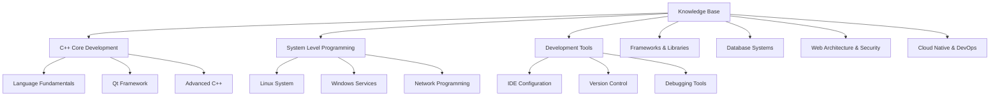

# Knowledge Base Blog

> A professional technical knowledge base built with Hexo static site generator, featuring comprehensive development documentation and tutorials.

## 🎯 Business Overview

**Knowledge Base Blog** is a centralized technical documentation platform that provides high-quality tutorials, best practices, and solution guides for software developers and IT professionals. The blog serves as:

- **Technical Knowledge Hub** - Curated collection of development tutorials and architectural guides
- **Professional Reference** - Quick access to proven solutions and code examples
- **Learning Platform** - Structured content from beginner to advanced topics
- **Community Resource** - Sharing practical insights and industry best practices

### Content Coverage

- **C++ Development** - Core language features, Qt framework, system programming
- **Web Architecture** - Server configuration, security, deployment strategies
- **DevOps & Cloud** - Containerization, CI/CD, cloud services management
- **Development Tools** - IDEs, version control, debugging and optimization
- **Database Systems** - Design, optimization, and administration

## 🛠️ Technology Stack

### Core Technologies

| Technology | Version | Purpose |
|------------|---------|---------|
| **Hexo** | 8.1.1 | Static site generator |
| **NexT Theme** | 8.26.0 | Professional blog theme |
| **Node.js** | - | Runtime environment |
| **GitHub Pages** | - | Hosting platform |

### Hexo Plugins & Extensions

```json
{
  "hexo-auto-excerpt": "^1.1.2",      // Auto-generate post excerpts
  "hexo-deployer-git": "^4.0.0",      // Git deployment automation
  "hexo-generator-archive": "^2.0.0", // Archive page generation
  "hexo-generator-category": "^2.0.0", // Category page generation
  "hexo-generator-index": "^3.0.0",   // Homepage generation
  "hexo-generator-searchdb": "^1.5.0", // Search functionality
  "hexo-generator-tag": "^2.0.0",     // Tag page generation
  "hexo-renderer-ejs": "^2.0.0",      // EJS template rendering
  "hexo-renderer-marked": "^6.3.0",   // Markdown rendering
  "hexo-renderer-stylus": "^3.0.1",   // Stylus CSS rendering
  "hexo-server": "^3.0.0"             // Local development server
}
```

## 🏗️ Architecture

### Directory Structure

```
blog/
├── _config.yml              # Hexo main configuration
├── _config.next.yml         # NexT theme configuration
├── package.json             # Node.js dependencies
├── source/                  # Source content directory
│   ├── _posts/             # Blog posts organized by category
│   │   ├── 01-CPP核心语言/
│   │   ├── 02-系统级编程/
│   │   ├── 03-开发工具/
│   │   ├── 05-框架库/
│   │   ├── 06-数据库系统/
│   │   ├── 07-Web架构安全/
│   │   └── 08-云原生运维/
│   ├── about/              # About page
│   ├── categories/         # Category pages
│   ├── tags/              # Tag pages
│   └── images/            # Static images and assets
├── themes/                # Theme files
├── public/               # Generated static site
├── .deploy_git/         # Git deployment cache
└── node_modules/        # Node.js dependencies
```

### Content Organization

The blog uses a hierarchical categorization system:



## 🚀 Quick Start

### Prerequisites

- **Node.js** (v14 or higher)
- **Git** for version control
- **GitHub account** for deployment

### Installation

1. **Clone the repository**
   ```bash
   git clone https://github.com/VilasWang/VilasWang.github.io.git blog
   cd blog
   ```

2. **Install dependencies**
   ```bash
   npm install
   ```

3. **Local development**
   ```bash
   npm run server
   # or
   hexo server
   ```

   Visit `http://localhost:4000` to preview the blog.

### Basic Workflow

1. **Create new post**
   ```bash
   npm run new "Your Post Title"
   # or
   hexo new "Your Post Title"
   ```

2. **Generate static site**
   ```bash
   npm run build
   # or
   hexo generate
   ```

3. **Deploy to GitHub Pages**
   ```bash
   npm run deploy
   # or
   hexo deploy
   ```

4. **Clean and rebuild**
   ```bash
   npm run clean
   npm run build
   ```

## 📝 Content Management

### Post Front Matter

Each blog post requires YAML front matter:

```yaml
---
title: "Article Title"
date: 2025-12-17 16:30:00
author: "vilas"
tags: [Tag1, Tag2, Tag3]
categories: [MainCategory, SubCategory]
description: "Brief description of the article content"
---
```

### Content Standards

- **Language**: Primarily Chinese with technical English terms
- **Format**: Markdown with proper syntax highlighting
- **Structure**: Clear headings, code examples, and practical explanations
- **SEO**: Optimized titles, descriptions, and relevant tags

### Category Structure

Content is organized into 8 main categories:

1. **C++ Core Language** (`01-CPP核心语言`)
   - Language fundamentals
   - Qt framework development
   - Advanced C++ techniques

2. **System Level Programming** (`02-系统级编程`)
   - Linux system administration
   - Windows service management
   - Network programming

3. **Development Tools** (`03-开发工具`)
   - IDE configuration and usage
   - Version control workflows
   - Debugging and profiling

4. **Frameworks & Libraries** (`05-框架库`)
   - Application frameworks
   - Third-party libraries
   - API integration

5. **Database Systems** (`06-数据库系统`)
   - Database design and optimization
   - Query optimization
   - Data administration

6. **Web Architecture & Security** (`07-Web架构安全`)
   - Web server configuration
   - Security implementations
   - Performance optimization

7. **Cloud Native & DevOps** (`08-云原生运维`)
   - Container technologies
   - CI/CD pipelines
   - Cloud services

## 🔧 Configuration

### Main Configuration (`_config.yml`)

Key settings in the main Hexo configuration:

```yaml
# Site Information
title: Knowledge Base Blog
author: vilas
language: en
timezone: Asia/Shanghai

# URL Configuration
url: https://VilasWang.github.io
permalink: :year/:month/:day/:title/

# Theme
theme: next

# Search Configuration
search:
  path: search.json
  field: post
  format: html
  limit: 10000

# Deployment
deploy:
  type: git
  repo: https://github.com/VilasWang/VilasWang.github.io.git
  branch: main
```

### Theme Configuration (`_config.next.yml`)

The NexT theme provides extensive customization options:

- **Style Settings** - Color schemes, fonts, layout
- **Menu Configuration** - Navigation structure
- **Social Links** - GitHub, LinkedIn, etc.
- **Comment Systems** - Disqus, Gitalk integration
- **Analytics** - Google Analytics, Baidu Tongji

## 🔍 Search Functionality

The blog includes a powerful search feature powered by `hexo-generator-searchdb`:

- **Full-text search** across all blog posts
- **Real-time results** with highlighting
- **Chinese support** with proper tokenization
- **Performance optimized** with pre-built search index

### Search Usage

1. Click the search icon or press `/` key
2. Enter keywords in Chinese or English
3. View matching results with relevance ranking
4. Click results to navigate to articles

## 🚀 Deployment

### Automated Deployment

The blog uses automated deployment to GitHub Pages:

```bash
# Single command deployment
hexo deploy
```

### Manual Deployment Steps

1. **Generate static files**
   ```bash
   hexo clean
   hexo generate
   ```

2. **Deploy to GitHub**
   ```bash
   hexo deploy
   ```

3. **Verify deployment**
   - Visit `https://VilasWang.github.io`
   - Check for successful content updates

### Deployment Configuration

The deployment is configured in `_config.yml`:

```yaml
deploy:
  type: git
  repo: https://github.com/VilasWang/VilasWang.github.io.git
  branch: main
  message: "Site updated: {{ now('YYYY-MM-DD HH:mm:ss') }}"
```

## 🛠️ Development Workflow

### Local Development

1. **Start development server**
   ```bash
   npm run server
   ```

2. **Live reload** - Changes are automatically reflected
3. **Debug mode** - Enhanced error reporting
4. **Draft preview** - Preview unpublished posts

### Content Creation Workflow

1. **Planning** - Define topic and category
2. **Creation** - Write content in Markdown
3. **Metadata** - Add proper front matter
4. **Review** - Local testing and proofreading
5. **Publication** - Generate and deploy

### Git Workflow

```bash
# 1. Create feature branch
git checkout -b new-article

# 2. Add content
git add .
git commit -m "Add new technical article: [Title]"

# 3. Deploy changes
hexo generate
hexo deploy

# 4. Merge to main
git checkout main
git merge new-article
git push origin main
```

## 📊 Performance Optimization

### Built-in Optimizations

- **Static Generation** - Pre-built HTML files for fast loading
- **Image Optimization** - Responsive images and lazy loading
- **CSS/JS Minification** - Reduced file sizes
- **CDN Ready** - Asset CDN integration support
- **SEO Optimized** - Meta tags, structured data, sitemaps

### Monitoring and Analytics

- **Search Analytics** - Track popular search terms
- **Content Performance** - Article view statistics
- **User Engagement** - Time on page and bounce rates
- **Technical Metrics** - Page load times and Core Web Vitals

## 🔧 Maintenance

### Regular Tasks

1. **Dependency Updates**
   ```bash
   npm audit
   npm update
   ```

2. **Content Review**
   - Update outdated articles
   - Fix broken links
   - Improve SEO metadata

3. **Performance Monitoring**
   - Check page load speeds
   - Monitor search functionality
   - Verify mobile responsiveness

### Backup Strategy

- **Git Repository** - Complete version control
- **Content Backup** - Original Markdown files
- **Configuration Backup** - Theme and Hexo settings
- **Deployment Backup** - GitHub Pages automatically hosts content

## 🤝 Contributing

### Content Guidelines

- **Quality Standards** - Technical accuracy and clarity
- **Formatting** - Consistent Markdown structure
- **Code Examples** - Tested, working code snippets
- **Documentation** - Proper explanations and comments

### Technical Requirements

- **Markdown Proficiency** - Familiarity with Markdown syntax
- **Git Knowledge** - Basic version control operations
- **Hexo Understanding** - Framework and configuration knowledge
- **Attention to Detail** - Quality and consistency focus

### Contribution Process

1. **Fork Repository** - Create personal copy
2. **Create Branch** - Isolate changes
3. **Add Content** - Follow established standards
4. **Test Locally** - Verify functionality
5. **Submit PR** - Request review and merge

## 📞 Support

### Common Issues

| Issue | Solution |
|-------|----------|
| **Build fails** | Check for Markdown syntax errors |
| **Search not working** | Rebuild search index with `hexo generate` |
| **Deployment errors** | Verify Git configuration and permissions |
| **Theme not loading** | Check theme installation and configuration |

### Resources

- **Hexo Documentation** - [https://hexo.io/docs/](https://hexo.io/docs/)
- **NexT Theme Guide** - [https://theme-next.js.org/](https://theme-next.js.org/)
- **Markdown Guide** - [https://www.markdownguide.org/](https://www.markdownguide.org/)
- **GitHub Pages** - [https://pages.github.com/](https://pages.github.com/)

---

**📈 Current Statistics**
- **Total Articles**: 100+ technical articles
- **Categories**: 8 main categories with 20+ subcategories
- **Search Index**: 10,000+ searchable terms
- **Update Frequency**: Weekly content additions
- **Performance**: <2s average load time

**🔗 Related Projects**
- [Knowledge Base Repository](../) - Main documentation repository
- [Blog Automation Tools](../blog-tools/) - Content management automation
- [Documentation Standards](../docs/standards/) - Writing and formatting guidelines

---

*Last updated: December 2025*
*Maintainer: vilas*
*License: MIT*