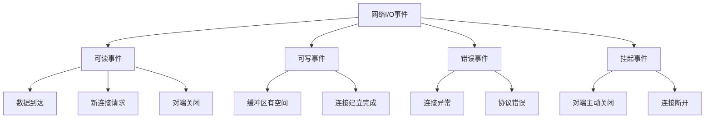
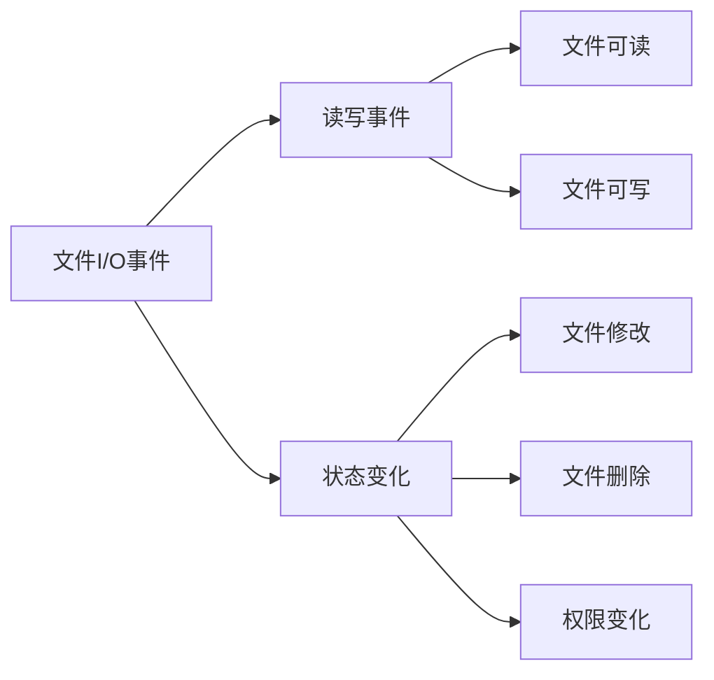
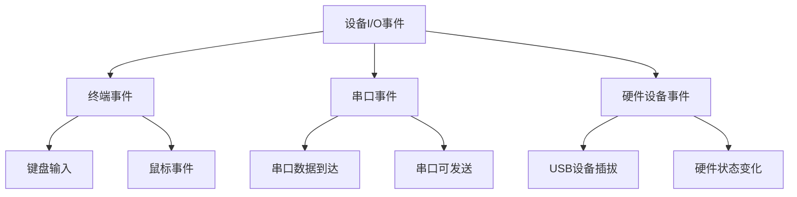
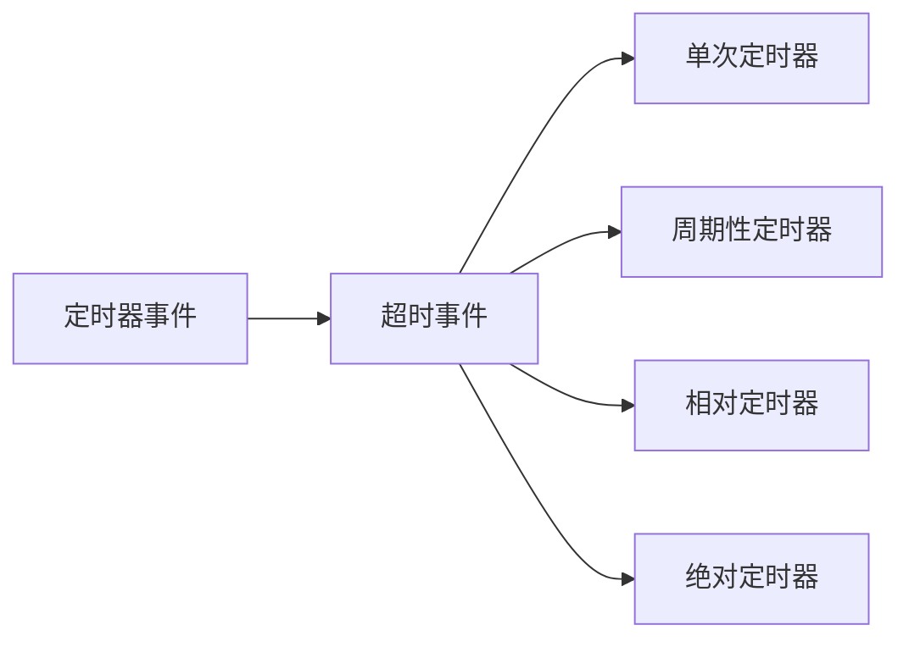
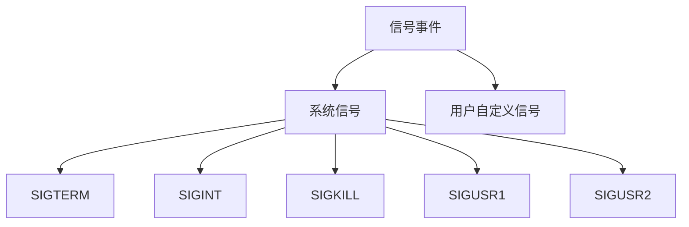
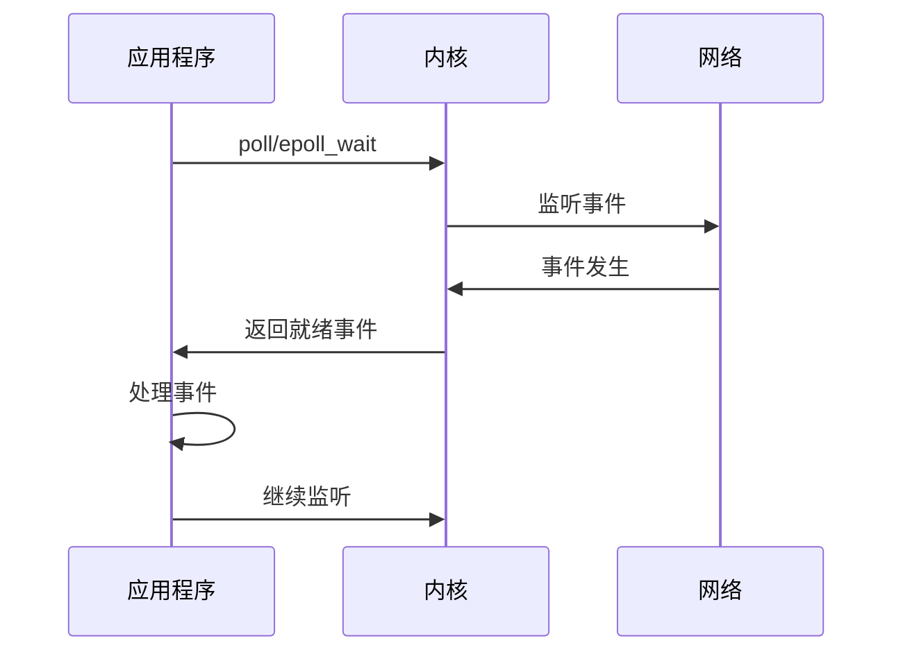

# IO 事件分类概念
> **文档创建时间**: 2025-11-14
> **最后更新**: 2025-11-14
> **标签**: `io`, `events`, `networking`, `system-programming`, `poll`, `epoll`

## 📑 目录

- [1. 概述](#1-概述)
- [2. I/O 事件类型](#2-io-事件类型)
  - [2.1 网络I/O事件](#21-网络io事件)
  - [2.2 文件I/O事件](#22-文件io事件)
  - [2.3 设备I/O事件](#23-设备io事件)
  - [2.4 定时器事件](#24-定时器事件)
  - [2.5 信号事件](#25-信号事件)
- [3. 网络编程中的I/O事件](#3-网络编程中的io事件)
- [4. 事件处理最佳实践](#4-事件处理最佳实践)

---

## 1. 📖 概述

在计算机系统中，I/O（输入/输出）事件是系统通知程序某个 I/O 操作状态变化的机制。正确理解和分类这些事件对于高效的网络编程至关重要。

---

## 2. 🔧 I/O 事件类型

### 2.1 🌐 网络I/O事件

网络编程中最常见的 I/O 事件类型：



#### 可读事件（Read Event）
- **定义**: 数据到达，可以读取
- **场景**:
  - 接收到网络数据
  - 新的连接请求（监听套接字）
  - 对端关闭连接（读取返回0）

#### 可写事件（Write Event）
- **定义**: 缓冲区有空间，可以写入数据
- **场景**:
  - 发送缓冲区有空间
  - 非阻塞连接建立完成

#### 错误事件（Error Event）
- **定义**: 连接出现错误
- **场景**:
  - 网络连接异常
  - 协议错误
  - 资源不足

#### 挂起事件（Hangup Event）
- **定义**: 连接被对端关闭
- **场景**:
  - 对端主动关闭连接
  - 连接断开

### 2.2 📁 文件I/O事件



#### 读写事件
- **文件可读**: 文件描述符可以进行读操作
- **文件可写**: 文件描述符可以进行写操作

#### 状态变化事件
- **文件修改**: 文件内容被修改
- **文件删除**: 文件被删除
- **权限变化**: 文件权限或所有者改变

### 2.3 🔌 设备I/O事件



### 2.4 ⏰ 定时器事件



### 2.5 📢 信号事件



---

## 3. 🌐 网络编程中的I/O事件

### 3.1 📋 事件类型详解

#### 1. 可读事件（POLLIN/POLLPRI）

```c
// 使用 poll 监听可读事件
struct pollfd fds[1];
fds[0].fd = sockfd;
fds[0].events = POLLIN;  // 监听可读事件

int ret = poll(fds, 1, timeout);

if (fds[0].revents & POLLIN) {
    // 处理可读事件
    handle_read_event(sockfd);
}
```

**表示的情况**:
- ✅ 有新数据到达，可以读取
- ✅ 新的连接请求到达（对于监听套接字）
- ✅ 对端关闭连接（读取时会返回0）

#### 2. 可写事件（POLLOUT）

```c
// 监听可写事件
struct pollfd fds[1];
fds[0].fd = sockfd;
fds[0].events = POLLOUT;  // 监听可写事件

int ret = poll(fds, 1, timeout);

if (fds[0].revents & POLLOUT) {
    // 处理可写事件
    handle_write_event(sockfd);
}
```

**表示的情况**:
- ✅ 发送缓冲区有空间
- ✅ 连接建立完成（对于非阻塞连接）

#### 3. 错误事件（POLLERR）

```c
// 检查错误事件
if (fds[0].revents & POLLERR) {
    // 处理错误事件
    handle_error_event(sockfd);
}
```

**表示的情况**:
- ❌ 连接异常
- ❌ 协议错误
- ❌ 网络不可达

#### 4. 挂起事件（POLLHUP）

```c
// 检查挂起事件
if (fds[0].revents & POLLHUP) {
    // 处理连接关闭
    handle_hangup_event(sockfd);
}
```

**表示的情况**:
- ⚠️ 对端主动关闭连接
- ⚠️ 连接断开

#### 5. 无效事件（POLLNVAL）

```c
// 检查无效事件
if (fds[0].revents & POLLNVAL) {
    // 处理无效文件描述符
    handle_invalid_event(sockfd);
}
```

**表示的情况**:
- ❌ 文件描述符未打开或已关闭

### 3.2 🔄 事件处理流程



---

## 4. 💡 事件处理最佳实践

### 4.1 🎯 事件处理策略

```c
// 事件处理的最佳实践示例
void handle_events(struct pollfd *fds, int nfds) {
    for (int i = 0; i < nfds; i++) {
        int fd = fds[i].fd;
        short revents = fds[i].revents;

        if (revents == 0) continue;  // 无事件

        // 优先处理错误和挂起事件
        if (revents & POLLNVAL) {
            close(fd);
            continue;
        }

        if (revents & POLLERR) {
            handle_socket_error(fd);
            continue;
        }

        if (revents & POLLHUP) {
            handle_socket_hangup(fd);
            continue;
        }

        // 处理可读事件
        if (revents & POLLIN) {
            handle_read_event(fd);
        }

        // 处理可写事件
        if (revents & POLLOUT) {
            handle_write_event(fd);
        }

        // 处理紧急数据
        if (revents & POLLPRI) {
            handle_urgent_data(fd);
        }
    }
}
```

### 4.2 ⚠️ 注意事项

1. **事件优先级**: 错误事件 > 挂起事件 > 读写事件
2. **边缘触发**: 使用 ET 模式时要确保处理完所有数据
3. **资源管理**: 及时关闭无效的文件描述符
4. **性能优化**: 避免不必要的事件监听

### 4.3 🔧 常见问题解决

| 问题 | 原因 | 解决方案 |
|------|------|----------|
| **CPU占用过高** | 忙等待或事件处理不当 | 使用阻塞I/O或优化事件循环 |
| **事件丢失** | 边缘触发模式处理不完整 | 使用水平触发或确保数据读完 |
| **连接泄漏** | 错误事件处理不当 | 及时清理和关闭连接 |

---

## 📊 总结

### ✅ 核心要点

- **I/O事件分类**: 网络、文件、设备、定时器、信号
- **网络事件处理**: 可读、可写、错误、挂起、无效
- **最佳实践**: 事件优先级、资源管理、性能优化

### 🎯 实际应用

- **Web服务器**: 处理HTTP请求和响应
- **代理服务器**: 转发客户端和服务器数据
- **聊天应用**: 实时消息传输
- **文件监控**: 监控文件系统变化

### 📚 扩展学习

- [Linux I/O 多路复用](https://man7.org/linux/man-pages/man2/poll.2.html)
- [epoll 编程指南](https://man7.org/linux/man-pages/man7/epoll.7.html)
- [高性能网络编程](https://github.com/ideawu/immerse)

---

> **💡 提示**: 在实际开发中，建议使用成熟的网络库（如 libevent、libuv）来处理复杂的事件管理，这些库已经处理了大部分边界情况和优化。