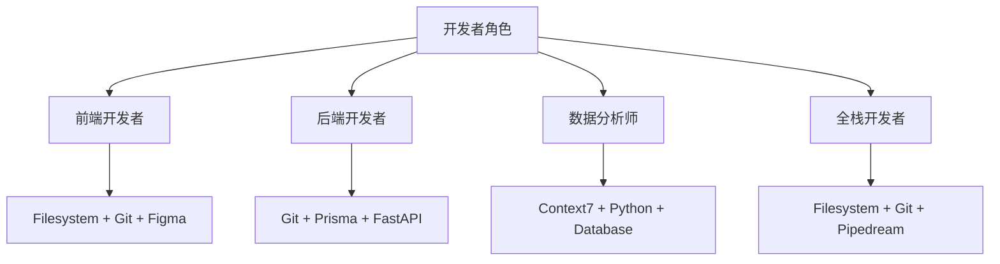

# Claude MCP 配置指南
> **文档创建时间**: 2025-11-14
> **最后更新**: 2025-11-14
> **标签**: `claude-code`, `mcp`, `model-context-protocol`, `productivity`, `automation`

## 📑 目录

- [1. MCP 概述](#1-mcp-概述)
- [2. 必装 MCP 服务器](#2-必装-mcp-服务器)
- [3. 推荐组合](#3-推荐组合)
- [4. 配置步骤](#4-配置步骤)
- [5. Top 15 MCP 服务器](#5-top-15-mcp-服务器)
- [6. 故障排除](#6-故障排除)

---

## 1. 📖 MCP 概述

MCP (Model Context Protocol) 是 Claude Code 的扩展协议，允许 AI 助手直接控制各种工具和服务。

### 🎯 MCP 优势
- ✅ **扩展能力** - 大幅扩展 Claude 的功能范围
- ✅ **自动化** - 实现复杂的自动化工作流
- ✅ **集成性** - 连接各种第三方服务和工具
- ✅ **实时性** - 获取最新的 API 文档和代码示例

---

## 2. ⭐ 必装 MCP 服务器

### 2.1 🌐 Playwright MCP - 浏览器自动化

**功能**: 让 Claude 直接控制浏览器进行测试、截图、数据爬取

```bash
# Claude MCP 配置指南
claude mcp add playwright -s user -- npx @playwright/mcp@latest

# Claude MCP 配置指南
claude mcp list
```

**适用场景**:
- 🔄 自动化测试
- 📸 网页截图
- 🕷️ 网页数据爬取
- 🎯 UI 交互测试

### 2.2 📚 Context7 MCP - 文档实时查询

**功能**: 获取各种编程库的最新文档和代码示例

```bash
# Claude MCP 配置指南
claude mcp add context7 -- npx -y @upstash/context7-mcp

# Claude MCP 配置指南
claude mcp add context7 -s user -- npx -y @upstash/context7-mcp
```

**适用场景**:
- 🔍 API 集成开发
- 📖 编程学习
- 💡 代码示例查找
- 🆕 新技术探索

### 2.3 🖥️ Filesystem MCP - 文件系统操作

**功能**: 读写和管理本地文件、文件夹，批量操作

```bash
# Claude MCP 配置指南
npm install -g @modelcontextprotocol/server-filesystem
```

**适用场景**:
- 📁 代码分析
- 📄 文档生成
- 💾 自动备份
- 🔄 批量文件处理

### 2.4 🔧 Git MCP - 版本控制

**功能**: 执行 Git 命令，管理版本控制

```bash
# Claude MCP 配置指南
npm install -g @modelcontextprotocol/server-github
```

**适用场景**:
- 📊 版本管理
- 🚀 自动化部署
- 👥 团队协作
- 🔍 代码审查

### 2.5 🗃️ Database MCP - 数据库连接

**功能**: 连接和管理多种数据库

```bash
# Claude MCP 配置指南
npm install -g @modelcontextprotocol/server-postgres
```

**适用场景**:
- 🗄️ 数据库管理
- 📊 数据分析
- 🔍 SQL 查询
- 💿 数据迁移

---

## 3. 🎯 推荐组合

### 3.1 📱 按角色分类



### 3.2 📦 5个必装组合

基于2025年使用统计，以下 MCP 服务器覆盖90%的日常需求：

1. **@modelcontextprotocol/server-filesystem** - 文件系统访问
2. **@modelcontextprotocol/server-github** - GitHub 集成
3. **@modelcontextprotocol/server-postgres** - 数据库连接
4. **@modelcontextprotocol/server-slack** - 团队协作
5. **@modelcontextprotocol/server-kubernetes** - 容器管理

---

## 4. ⚙️ 配置步骤

### 4.1 🔍 步骤1: 安装 MCP 服务器

```bash
# Claude MCP 配置指南
npm install -g @modelcontextprotocol/server-browserkit \
  @modelcontextprotocol/server-ollama \
  @modelcontextprotocol/server-filesystem \
  @modelcontextprotocol/server-github \
  @modelcontextprotocol/server-postgres
```

### 4.2 📝 步骤2: 配置 Claude Code CLI

Claude Code CLI 的配置文件位于：

- **macOS / Linux**: `~/.config/claude/claude_desktop_config.json`
- **Windows**: `%USERPROFILE%\.claude.json`

### 4.3 📄 步骤3: 配置示例

```json
{
  "mcpServers": {
    "browserkit": {
      "command": "npx",
      "args": [
        "-y",
        "@modelcontextprotocol/server-browserkit"
      ]
    },
    "ollama": {
      "command": "npx",
      "args": [
        "-y",
        "@modelcontextprotocol/server-ollama"
      ]
    },
    "filesystem": {
      "command": "npx",
      "args": [
        "-y",
        "@modelcontextprotocol/server-filesystem",
        "/path/to/allowed/directory"
      ]
    },
    "github": {
      "command": "npx",
      "args": [
        "-y",
        "@modelcontextprotocol/server-github"
      ]
    }
  }
}
```

### 4.4 🔧 步骤4: 特殊配置

#### Xmind 生成器 MCP

```json
{
  "mcpServers": {
    "xmind": {
      "command": "npx",
      "args": ["xmind-generator-mcp"],
      "env": {
        "outputPath": "E:/xmind_generator_mcp_path",
        "autoOpenFile": "false"
      }
    }
  }
}
```

#### Office Word MCP

```bash
# Claude MCP 配置指南
claude mcp add office-word -s user -- uvx --from office-word-mcp-server word_mcp_server
```

---

## 5. 📊 Top 15 MCP 服务器

| 排名 | 名称 | Star数 | 核心功能 | 最佳场景 |
|------|------|--------|----------|----------|
| 1 | Filesystem MCP | 64,053 ⭐ | 读写/管理本地文件、文件夹 | 代码分析、文档生成、自动备份 |
| 2 | Git MCP | 64,053 ⭐ | 执行git命令，查看历史和差异 | 版本管理、自动化部署、团队协作 |
| 3 | Prisma MCP | 43,499 ⭐ | 管理Prisma数据库模式 | Web开发、数据库设计 |
| 4 | Context7 MCP | 25,610 ⭐ | 获取最新库文档和代码示例 | API集成、编程学习 |
| 5 | GitHub MCP | 20,923 ⭐ | 管理仓库、PR和Issues | 开源项目管理、CI/CD |
| 6 | Task Master | 20,520 ⭐ | 智能任务分解和优先级管理 | 项目管理、敏捷开发 |
| 7 | Repomix | 18,511 ⭐ | 压缩代码库为AI友好格式 | 大型代码审查、架构分析 |
| 8 | BlenderMCP | 12,829 ⭐ | 控制Blender进行3D建模 | 游戏开发、3D设计 |
| 9 | mcp-run-python | 11,603 ⭐ | 安全运行Python代码 | 算法验证、数据分析 |
| 10 | Pipedream | 10,139 ⭐ | 连接2500+应用和API | 业务流程自动化、数据同步 |
| 11 | Figma MCP | 9,891 ⭐ | 读取Figma设计，生成前端代码 | UI/UX开发、设计转代码 |
| 12 | 数据库MCP工具箱 | 9,229 ⭐ | 支持多数据库查询和优化 | 数据库管理、数据分析 |
| 13 | Serena | 8,743 ⭐ | 大型代码库符号化分析 | 代码重构、bug修复 |
| 14 | FastAPI-MCP | 7,857 ⭐ | 零配置集成FastAPI | API开发、微服务 |
| 15 | Fonoster MCP | 6,740 ⭐ | 管理电话系统 | 客服系统、电话营销 |

---

## 6. 🔧 故障排除

### 6.1 ❌ 常见问题

#### 问题1: MCP 服务器无法启动
```bash
# Claude MCP 配置指南
claude mcp list

# Claude MCP 配置指南
claude mcp remove <server-name>
claude mcp add <server-name> <command>
```

#### 问题2: 配置文件格式错误
```json
// 验证 JSON 格式
{
  "mcpServers": {
    "server-name": {
      "command": "command-string",
      "args": ["arg1", "arg2"]
    }
  }
}
```

#### 问题3: 权限问题
```bash
# Claude MCP 配置指南
ls -la ~/.claude.json

# Claude MCP 配置指南
chmod 600 ~/.claude.json
```

### 6.2 🛠️ 调试技巧

1. **查看日志**: 检查 Claude Code 的日志输出
2. **测试连接**: 使用简单的命令测试 MCP 服务器
3. **逐步配置**: 一次只添加一个 MCP 服务器
4. **版本检查**: 确保所有依赖版本兼容

### 6.3 📞 获取帮助

- **官方文档**: [Claude Code MCP Documentation](https://docs.anthropic.com/claude/docs/mcp)
- **社区支持**: GitHub Issues 和 Discussions
- **示例配置**: 官方示例仓库

---

## 📚 扩展资源

### 🔗 相关链接
- [MCP 官方文档](https://modelcontextprotocol.io/)
- [Claude Code 指南](https://docs.anthropic.com/claude/docs)
- [MCP 服务器列表](https://github.com/modelcontextprotocol/servers)

### 🎯 学习路径
1. **基础配置** - 从简单的 Filesystem MCP 开始
2. **功能扩展** - 逐步添加专业领域 MCP
3. **自定义开发** - 学习开发自定义 MCP 服务器
4. **最佳实践** - 掌握高级配置和优化技巧

---

## 📈 使用建议

### 💡 效率提升技巧

1. **按需安装** - 只安装当前项目需要的 MCP
2. **定期更新** - 保持 MCP 服务器为最新版本
3. **性能优化** - 监控 MCP 服务器资源使用情况
4. **安全考虑** - 限制文件系统访问范围

### 🔄 工作流优化


---

> **💡 提示**: MCP 配置是一个迭代过程，建议从基础功能开始，逐步扩展到复杂的自动化工作流。定期检查更新以获得最新功能和安全修复。