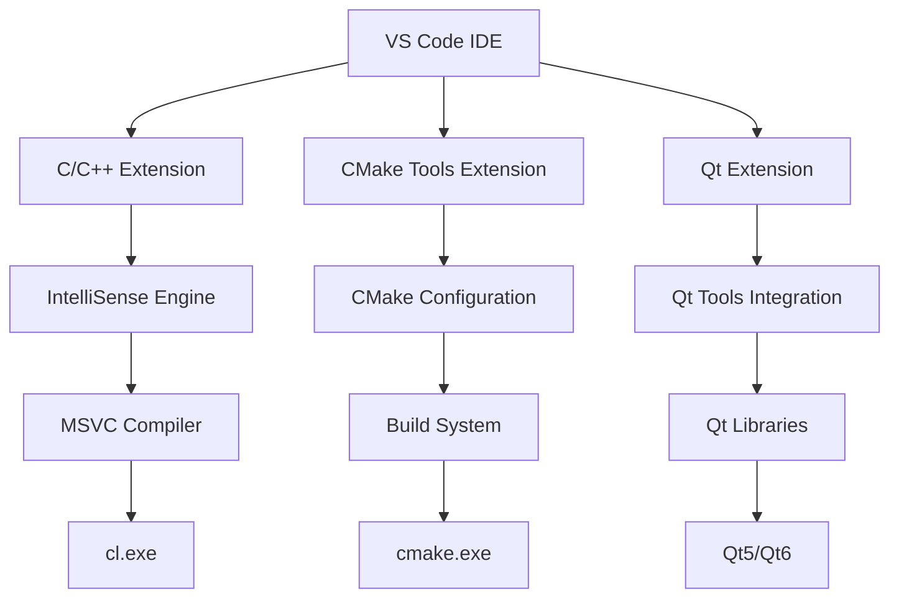
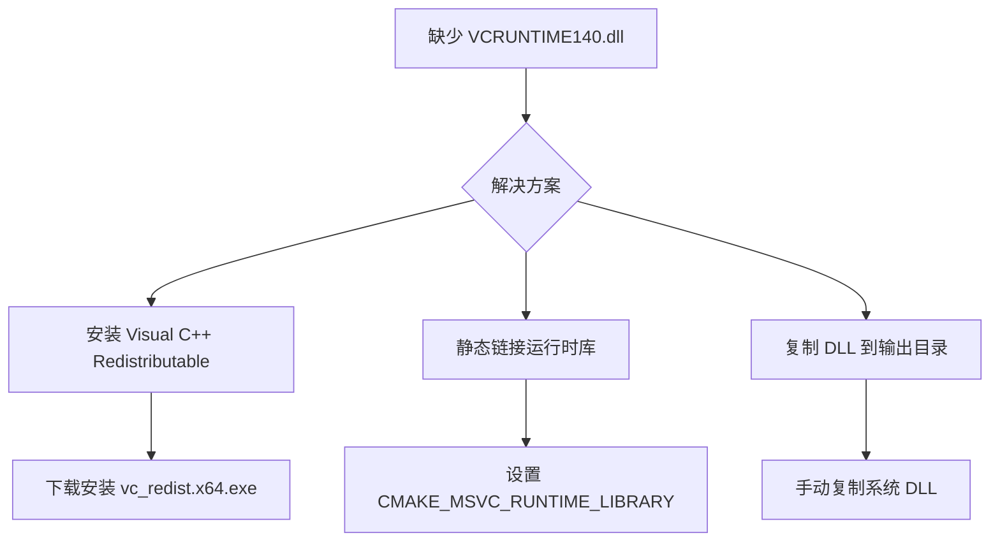

# VSCode Qt MSVC 配置指南
> **文档创建时间**: 2025-11-14
> **最后更新**: 2025-11-14
> **标签**: `vscode`, `qt`, `msvc`, `cmake`, `windows`, `development`, `cpp`

## 📑 目录

- [1. 概述](#1-概述)
- [2. 环境准备](#2-环境准备)
- [3. VS Code 配置](#3-vs-code-配置)
  - [3.1 C/C++ 扩展配置](#31-c-c-扩展配置)
  - [3.2 调试器配置](#32-调试器配置)
  - [3.3 构建任务配置](#33-构建任务配置)
  - [3.4 Qt 可视化调试](#34-qt-可视化调试)
- [4. CMake 配置](#4-cmake-配置)
- [5. 环境验证](#5-环境验证)
- [6. 常见问题解决](#6-常见问题解决)
- [7. 完整工作流程](#7-完整工作流程)

---

## 1. 📖 概述

本指南详细介绍如何在 Windows 系统上配置 VS Code 进行 Qt C++ 开发，使用 MSVC 编译器和 CMake 构建系统。

### 🎯 配置目标
- ✅ 使用 MSVC 编译器进行 Qt 开发
- ✅ VS Code 完整的 IntelliSense 支持
- ✅ 集成的调试和构建功能
- ✅ 跨平台 CMake 构建系统

### 🏗️ 系统架构



---

## 2. 🔧 环境准备

### 2.1 必需组件

| 组件 | 版本要求 | 下载地址 |
|------|----------|----------|
| **Visual Studio Build Tools** | 2019/2022 | [Microsoft官网](https://visualstudio.microsoft.com/downloads/) |
| **Qt** | 5.6.3+ / 6.x | [Qt官网](https://www.qt.io/download) |
| **CMake** | 3.15+ | [CMake官网](https://cmake.org/download/) |
| **VS Code** | 最新版 | [VS Code官网](https://code.visualstudio.com/) |

### 2.2 VS Code 扩展安装

```bash
# VSCode Qt MSVC 配置指南
code --install-extension ms-vscode.cpptools
code --install-extension ms-vscode.cmake-tools
code --install-extension ms-vscode.cpptools-extension-pack

# VSCode Qt MSVC 配置指南
code --install-extension twxs.cmake
code --install-extension ms-vscode.hexeditor
```

---

## 3. ⚙️ VS Code 配置

### 3.1 🧠 C/C++ 扩展配置

创建 `.vscode/c_cpp_properties.json`：

```json
{
    "configurations": [
        {
            "name": "Win32-MSVC",
            "includePath": [
                "${workspaceFolder}/**",
                // MSVC 标准库路径
                "${env.VCToolsInstallDir}include",
                // Windows SDK 路径
                "${env.WindowsSdkDir}Include/${env.WindowsSDKVersion}/**",
                // Qt 包含路径（修改为你的实际路径）
                "C:/Qt/Qt5.6.3/5.6.3/msvc2015_64/include/**",
                "C:/Qt/Qt5.6.3/5.6.3/msvc2015_64/include/QtCore",
                "C:/Qt/Qt5.6.3/5.6.3/msvc2015_64/include/QtWidgets",
                "C:/Qt/Qt5.6.3/5.6.3/msvc2015_64/include/QtGui",
                // 添加其他需要的 Qt 模块
                "C:/Qt/Qt5.6.3/5.6.3/msvc2015_64/include/QtNetwork"
            ],
            "defines": [
                "_DEBUG",
                "UNICODE",
                "_UNICODE",
                // Qt 相关定义
                "QT_CORE_LIB",
                "QT_WIDGETS_LIB",
                "QT_GUI_LIB",
                "QT_NETWORK_LIB",
                "_WIN32_WINNT=0x0601"  // Windows 7+
            ],
            "compilerPath": "C:/Program Files (x86)/Microsoft Visual Studio/2019/BuildTools/VC/Tools/MSVC/14.29.30133/bin/Hostx64/x64/cl.exe",
            "cStandard": "c17",
            "cppStandard": "c++17",
            "intelliSenseMode": "windows-msvc-x64",
            "windowsSdkVersion": "10.0.19041.0",
            "compileCommands": "${workspaceFolder}/build/compile_commands.json"
        }
    ],
    "version": 4
}
```

**⚙️ 关键配置说明**：

| 配置项 | 说明 | 示例值 |
|--------|------|--------|
| **compilerPath** | MSVC 编译器路径 | `cl.exe` 完整路径 |
| **intelliSenseMode** | IntelliSense 引擎 | `windows-msvc-x64` |
| **includePath** | 头文件搜索路径 | Qt 和 MSVC 包含目录 |
| **defines** | 预处理器宏定义 | Qt 模块和 Windows 宏 |

### 3.2 🐛 调试器配置

创建 `.vscode/launch.json`：

```json
{
    "version": "0.2.0",
    "configurations": [
        {
            "name": "Debug Qt App (MSVC)",
            "type": "cppvsdbg",
            "request": "launch",
            "program": "${workspaceFolder}/build/Debug/MyQtApp.exe",
            "args": [],
            "stopAtEntry": false,
            "cwd": "${workspaceFolder}",
            "environment": [
                {
                    "name": "PATH",
                    "value": "${env:Path};C:/Qt/Qt5.6.3/5.6.3/msvc2015_64/bin;C:/Qt/Qt5.6.3/5.6.3/msvc2015_64/plugins/platforms"
                },
                {
                    "name": "QT_DEBUG_PLUGINS",
                    "value": "1"
                }
            ],
            "console": "externalTerminal",
            "visualizerFile": "${workspaceFolder}/.vscode/qt.natvis",
            "preLaunchTask": "cmake: build debug",
            "postDebugTask": "cmake: clean"
        },
        {
            "name": "Release Qt App (MSVC)",
            "type": "cppvsdbg",
            "request": "launch",
            "program": "${workspaceFolder}/build/Release/MyQtApp.exe",
            "args": [],
            "stopAtEntry": false,
            "cwd": "${workspaceFolder}",
            "environment": [
                {
                    "name": "PATH",
                    "value": "${env:Path};C:/Qt/Qt5.6.3/5.6.3/msvc2015_64/bin"
                }
            ],
            "console": "externalTerminal",
            "preLaunchTask": "cmake: build release"
        }
    ]
}
```

**🔍 调试配置要点**：

- **调试器类型**: 使用 `cppvsdbg` (MSVC 原生调试器)
- **环境变量**: 确保 Qt DLL 和插件路径在 PATH 中
- **程序路径**: Debug 和 Release 版本的正确路径
- **调试插件**: `QT_DEBUG_PLUGINS=1` 用于调试 Qt 插件问题

### 3.3 🔨 构建任务配置

创建 `.vscode/tasks.json`：

```json
{
    "version": "2.0.0",
    "tasks": [
        {
            "label": "cmake: configure",
            "type": "shell",
            "command": "cmake",
            "args": [
                "-B", "build",
                "-G", "Visual Studio 16 2019",
                "-A", "x64",
                "-DCMAKE_BUILD_TYPE=Debug",
                "-DCMAKE_PREFIX_PATH=C:/Qt/Qt5.6.3/5.6.3/msvc2015_64"
            ],
            "group": "build",
            "problemMatcher": [],
            "detail": "配置 CMake 项目"
        },
        {
            "label": "cmake: build debug",
            "type": "shell",
            "command": "cmake",
            "args": [
                "--build", "build",
                "--config", "Debug",
                "--parallel"
            ],
            "group": {
                "kind": "build",
                "isDefault": true
            },
            "problemMatcher": ["$msCompile"],
            "detail": "构建 Debug 版本",
            "dependsOn": ["cmake: configure"]
        },
        {
            "label": "cmake: build release",
            "type": "shell",
            "command": "cmake",
            "args": [
                "--build", "build",
                "--config", "Release",
                "--parallel"
            ],
            "group": "build",
            "problemMatcher": ["$msCompile"],
            "detail": "构建 Release 版本"
        },
        {
            "label": "cmake: clean",
            "type": "shell",
            "command": "cmake",
            "args": [
                "--build", "build",
                "--target", "clean"
            ],
            "group": "build",
            "problemMatcher": [],
            "detail": "清理构建文件"
        },
        {
            "label": "cmake: install qt dlls",
            "type": "shell",
            "command": "powershell",
            "args": [
                "-Command",
                "Copy-Item 'C:\\Qt\\Qt5.6.3\\5.6.3\\msvc2015_64\\bin\\*.dll' 'build\\Debug\\' -Force; Copy-Item 'C:\\Qt\\Qt5.6.3\\5.6.3\\msvc2015_64\\plugins\\platforms\\qwindows.dll' 'build\\Debug\\platforms\\' -Force"
            ],
            "group": "build",
            "problemMatcher": [],
            "detail": "复制 Qt 运行时 DLL"
        }
    ]
}
```

### 3.4 🎨 Qt 可视化调试

创建 `.vscode/qt.natvis` 文件用于 Qt 类型可视化：

```xml
<?xml version="1.0" encoding="utf-8"?>
<AutoVisualizer xmlns="http://schemas.microsoft.com/vstudio/debugger/natvis/2010">
  <Type Name="QString">
    <DisplayString>{{ {reinterpret_cast<const wchar_t*>(d->data()), d->size} }}</DisplayString>
    <StringView>d->data(),d->size,utf-16</StringView>
    <Expand>
      <Item Name="[size]">d->size</Item>
      <Item Name="[raw]">d->data(),d->size</Item>
    </Expand>
  </Type>

  <Type Name="QByteArray">
    <DisplayString>{{ {d->data(),d->size} }}</DisplayString>
    <StringView>d->data(),d->size</StringView>
    <Expand>
      <Item Name="[size]">d->size</Item>
      <ArrayItems>
        <Size>d->size</Size>
        <ValuePointer>d->data()</ValuePointer>
      </ArrayItems>
    </Expand>
  </Type>

  <Type Name="QList&lt;*&gt;">
    <DisplayString>{{ size={d->size} }}</DisplayString>
    <Expand>
      <Item Name="[size]">d->size</Item>
      <ArrayItems>
        <Size>d->size</Size>
        <ValuePointer>e</ValuePointer>
      </ArrayItems>
    </Expand>
  </Type>
</AutoVisualizer>
```

---

## 4. 📦 CMake 配置

### 4.1 📄 CMakeLists.txt

```cmake
cmake_minimum_required(VERSION 3.15)
project(MyQtApp LANGUAGES CXX)

# VSCode Qt MSVC 配置指南
set(CMAKE_CXX_STANDARD 17)
set(CMAKE_CXX_STANDARD_REQUIRED ON)

# VSCode Qt MSVC 配置指南
if(MSVC)
    # 设置运行时库
    set(CMAKE_MSVC_RUNTIME_LIBRARY "MultiThreaded$<$<CONFIG:Debug>:Debug>DLL")

    # 启用并行编译
    add_compile_options(/MP)

    # 警告设置
    add_compile_options(/W3)

    # 禁用一些 MSVC 警告
    add_compile_definitions(_CRT_SECURE_NO_WARNINGS)
endif()

# VSCode Qt MSVC 配置指南
set(CMAKE_PREFIX_PATH "C:/Qt/Qt5.6.3/5.6.3/msvc2015_64")
set(CMAKE_AUTOMOC ON)
set(CMAKE_AUTOUIC ON)
set(CMAKE_AUTORCC ON)

# VSCode Qt MSVC 配置指南
find_package(Qt5 COMPONENTS Core Widgets Gui Network REQUIRED)

# VSCode Qt MSVC 配置指南
file(GLOB_RECURSE SOURCES
    "src/*.cpp"
    "src/*.h"
    "src/*.ui"
)

# VSCode Qt MSVC 配置指南
add_executable(MyQtApp ${SOURCES})

# VSCode Qt MSVC 配置指南
target_link_libraries(MyQtApp
    Qt5::Core
    Qt5::Widgets
    Qt5::Gui
    Qt5::Network
)

# VSCode Qt MSVC 配置指南
set_target_properties(MyQtApp PROPERTIES
    RUNTIME_OUTPUT_DIRECTORY_DEBUG ${CMAKE_BINARY_DIR}/Debug
    RUNTIME_OUTPUT_DIRECTORY_RELEASE ${CMAKE_BINARY_DIR}/Release
)

# VSCode Qt MSVC 配置指南
if(WIN32)
    # 设置 Windows 子系统
    set_target_properties(MyQtApp PROPERTIES
        WIN32_EXECUTABLE TRUE
    )

    # 复制 Qt DLL 到输出目录
    add_custom_command(TARGET MyQtApp POST_BUILD
        COMMAND ${CMAKE_COMMAND} -E copy_directory
        "${CMAKE_PREFIX_PATH}/bin"
        $<TARGET_FILE_DIR:MyQtApp>
        COMMENT "Copying Qt DLLs to output directory"
    )
endif()
```

### 4.2 🔧 CMakePresets.json (可选)

创建 `CMakePresets.json` 简化配置：

```json
{
    "version": 3,
    "cmakeMinimumRequired": {
        "major": 3,
        "minor": 15,
        "patch": 0
    },
    "configurePresets": [
        {
            "name": "windows-msvc-debug",
            "generator": "Visual Studio 16 2019",
            "architecture": "x64",
            "toolset": "host=x64",
            "binaryDir": "${sourceDir}/build",
            "cacheVariables": {
                "CMAKE_BUILD_TYPE": "Debug",
                "CMAKE_PREFIX_PATH": "C:/Qt/Qt5.6.3/5.6.3/msvc2015_64",
                "CMAKE_MSVC_RUNTIME_LIBRARY": "MultiThreadedDebugDLL"
            }
        },
        {
            "name": "windows-msvc-release",
            "generator": "Visual Studio 16 2019",
            "architecture": "x64",
            "toolset": "host=x64",
            "binaryDir": "${sourceDir}/build",
            "cacheVariables": {
                "CMAKE_BUILD_TYPE": "Release",
                "CMAKE_PREFIX_PATH": "C:/Qt/Qt5.6.3/5.6.3/msvc2015_64",
                "CMAKE_MSVC_RUNTIME_LIBRARY": "MultiThreadedDLL"
            }
        }
    ],
    "buildPresets": [
        {
            "name": "debug",
            "configurePreset": "windows-msvc-debug",
            "configuration": "Debug"
        },
        {
            "name": "release",
            "configurePreset": "windows-msvc-release",
            "configuration": "Release"
        }
    ]
}
```

---

## 5. ✅ 环境验证

### 5.1 🔍 命令行验证

```powershell
# VSCode Qt MSVC 配置指南
cl.exe /?
# VSCode Qt MSVC 配置指南
# VSCode Qt MSVC 配置指南
qmake -query
# VSCode Qt MSVC 配置指南
# VSCode Qt MSVC 配置指南
# VSCode Qt MSVC 配置指南
# VSCode Qt MSVC 配置指南
# VSCode Qt MSVC 配置指南
cmake -G
# VSCode Qt MSVC 配置指南
# VSCode Qt MSVC 配置指南
echo $env:VCToolsInstallDir
echo $env:WindowsSdkDir
echo $env:WindowsSDKVersion
```

### 5.2 🧪 测试项目创建

创建测试源文件 `src/main.cpp`：

```cpp
#include <QApplication>
#include <QMainWindow>
#include <QLabel>
#include <QVBoxLayout>
#include <QPushButton>
#include <QMessageBox>
#include <QDebug>

class MainWindow : public QMainWindow {
    Q_OBJECT

public:
    MainWindow(QWidget *parent = nullptr) : QMainWindow(parent) {
        setWindowTitle("Qt MSVC Test App");
        resize(400, 300);

        QWidget *centralWidget = new QWidget(this);
        setCentralWidget(centralWidget);

        QVBoxLayout *layout = new QVBoxLayout(centralWidget);

        QLabel *label = new QLabel("Hello Qt with MSVC!", this);
        label->setAlignment(Qt::AlignCenter);
        label->setStyleSheet("font-size: 18px; font-weight: bold;");
        layout->addWidget(label);

        QPushButton *button = new QPushButton("Test Message", this);
        connect(button, &QPushButton::clicked, this, &MainWindow::showTestMessage);
        layout->addWidget(button);

        QPushButton *debugButton = new QPushButton("Print Debug Info", this);
        connect(debugButton, &QPushButton::clicked, this, &MainWindow::printDebugInfo);
        layout->addWidget(debugButton);
    }

private slots:
    void showTestMessage() {
        QMessageBox::information(this, "Test", "MSVC + Qt 配置成功！");
        qDebug() << "Message box shown successfully";
    }

    void printDebugInfo() {
        qDebug() << "=== Qt Configuration Info ===";
        qDebug() << "Qt Version:" << QT_VERSION_STR;
        qDebug() << "Compiler:" <<
#ifdef _MSC_VER
            "MSVC " << _MSC_VER;
#else
            "Unknown";
#endif
        qDebug() << "Build Type:" <<
#ifdef _DEBUG
            "Debug";
#else
            "Release";
#endif
        qDebug() << "===============================";
    }
};

int main(int argc, char *argv[]) {
    QApplication app(argc, argv);

    qDebug() << "Starting Qt application...";
    qDebug() << "Qt version:" << QT_VERSION_STR;

    MainWindow window;
    window.show();

    return app.exec();
}

#include "main.moc"
```

---

## 6. 🔧 常见问题解决

### 6.1 ❌ CMake 找不到 Qt

**错误信息**: `Could NOT find Qt5`

**解决方案**：
```cmake
# VSCode Qt MSVC 配置指南
set(CMAKE_PREFIX_PATH "C:/Qt/Qt5.6.3/5.6.3/msvc2015_64")

# VSCode Qt MSVC 配置指南
set(ENV{QTDIR} "C:/Qt/Qt5.6.3/5.6.3/msvc2015_64")
```

### 6.2 ❌ 缺少运行时库

**错误信息**: `无法启动此程序，因为计算机中缺少 VCRUNTIME140.dll`

**解决方案**：


**CMake 配置**：
```cmake
# VSCode Qt MSVC 配置指南
set(CMAKE_MSVC_RUNTIME_LIBRARY "MultiThreaded$<$<CONFIG:Debug>:Debug>")
```

### 6.3 ❌ Qt 插件加载失败

**错误信息**: `This application failed to start because it could not find or load the Qt platform plugin "windows"`

**解决方案**：
```json
// 在 launch.json 中添加环境变量
"environment": [
    {
        "name": "PATH",
        "value": "${env:Path};C:/Qt/Qt5.6.3/5.6.3/msvc2015_64/bin;C:/Qt/Qt5.6.3/5.6.3/msvc2015_64/plugins/platforms"
    }
]
```

### 6.4 ❌ IntelliSense 不工作

**症状**: Qt 头文件显示红色下划线，代码补全不工作

**解决方案**：
1. 检查 `c_cpp_properties.json` 中的路径是否正确
2. 确保 Qt 版本与编译器版本匹配 (MSVC vs MinGW)
3. 重新加载 VS Code 窗口 (`Ctrl+Shift+P` → `Developer: Reload Window`)

### 6.5 ❌ 调试时无法查看 Qt 对象

**解决方案**：
1. 安装 [Qt Visual Studio Tools](https://marketplace.visualstudio.com/items?itemName=TheQtCompany.QtVisualStudioTools2019)
2. 使用自定义的 `qt.natvis` 文件
3. 在调试时查看 `this` 指针和成员变量

---

## 7. 🚀 完整工作流程


### 7.1 📝 日常开发步骤

1. **打开项目**：VS Code 打开项目文件夹
2. **配置 CMake**：`Ctrl+Shift+P` → `CMake: Configure`
3. **选择预设**：底部状态栏选择 `windows-msvc-debug` 或 `windows-msvc-release`
4. **智能提示**：等待 IntelliSense 完成初始化
5. **编写代码**：享受完整的代码补全和语法高亮
6. **构建项目**：`Ctrl+Shift+B` 或点击底部状态栏的构建按钮
7. **运行调试**：`F5` 启动调试会话

### 7.2 🎯 推荐快捷键

| 快捷键 | 功能 | 说明 |
|--------|------|------|
| `Ctrl+Shift+B` | 构建项目 | 执行默认构建任务 |
| `F5` | 启动调试 | 运行当前配置的调试会话 |
| `Ctrl+Shift+P` | 命令面板 | 访问所有 VS Code 命令 |
| `Ctrl+,` | 设置 | 打开 VS Code 设置 |
| `Ctrl+K Ctrl+S` | 快捷键设置 | 自定义快捷键 |

---

## 📊 总结

### ✅ 配置完成检查清单

- [x] Visual Studio Build Tools 安装完成
- [x] Qt MSVC 版本安装完成
- [x] VS Code 必需扩展安装
- [x] C/C++ 配置文件正确设置
- [x] CMake 配置文件正确设置
- [x] 调试器配置正确
- [x] 测试项目编译运行成功
- [x] 调试功能正常工作
- [x] IntelliSense 完整支持

### 🎯 下一步建议

1. **学习 Qt 框架**：掌握信号槽、UI 设计、多线程等
2. **CMake 进阶**：学习自定义构建规则、交叉编译
3. **调试技巧**：掌握断点、内存查看、性能分析
4. **版本控制**：集成 Git 进行代码管理
5. **单元测试**：集成 Qt Test 或 Google Test

### 📚 推荐资源

- [Qt 官方文档](https://doc.qt.io/)
- [CMake 官方文档](https://cmake.org/documentation/)
- [VS Code C++ 扩展文档](https://code.visualstudio.com/docs/cpp/)
- [Microsoft C++ 文档](https://docs.microsoft.com/en-us/cpp/)

---

> **💡 提示**:
> - 首次配置可能需要一些时间，耐心按照步骤操作
> - 遇到问题时，首先检查路径和环境变量是否正确
> - 建议使用相对路径和 CMake 变量提高项目可移植性
> - 定期更新 VS Code 扩展以获得最新功能