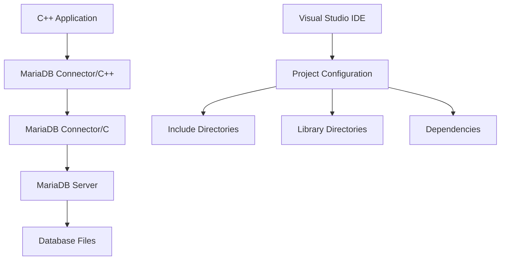
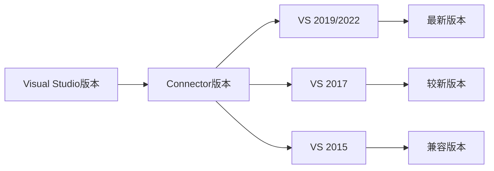
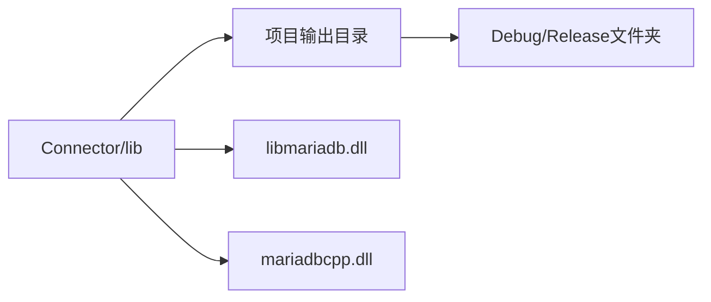
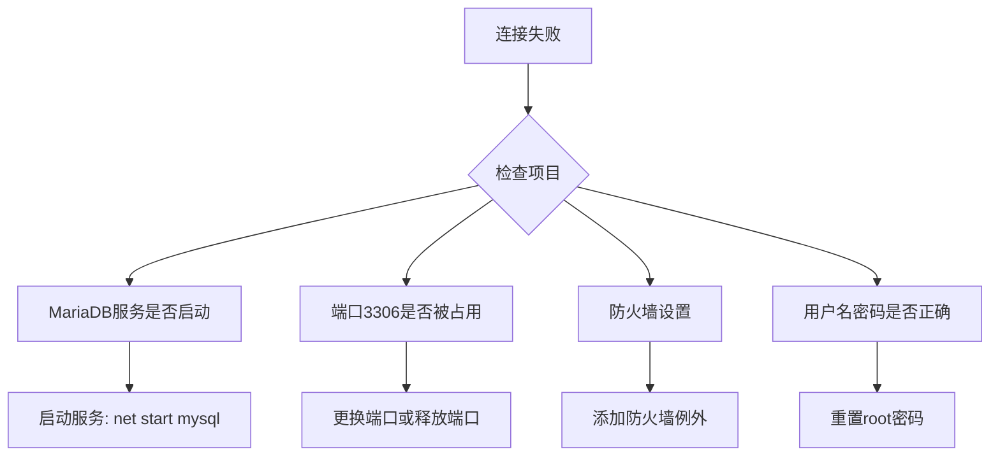

# MariaDB C++ Windows 安装指南
> **文档创建时间**: 2025-11-14
> **最后更新**: 2025-11-14
> **标签**: `mariadb`, `cpp`, `windows`, `development`, `database`, `connector`

## 📑 目录

- [1. 概述](#1-概述)
- [2. 安装 MariaDB 服务器](#2-安装-mariadb-服务器)
  - [2.1 获取安装程序](#21-获取安装程序)
  - [2.2 运行安装向导](#22-运行安装向导)
  - [2.3 验证安装](#23-验证安装)
- [3. 安装 MariaDB 连接器](#3-安装-mariadb-连接器)
  - [3.1 Connector/C++](#31-connectorc)
  - [3.2 Connector/C](#32-connectorc)
  - [3.3 配置环境变量](#33-配置环境变量)
- [4. 配置 Visual Studio 项目](#4-配置-visual-studio-项目)
  - [4.1 包含头文件目录](#41-包含头文件目录)
  - [4.2 配置库文件目录](#42-配置库文件目录)
  - [4.3 指定依赖的库文件](#43-指定依赖的库文件)
  - [4.4 拷贝 DLL 文件](#44-拷贝-dll-文件)
- [5. 编写测试代码](#5-编写测试代码)
- [6. 常见问题和解决方案](#6-常见问题和解决方案)
- [7. 高级配置](#7-高级配置)

---

## 1. 📖 概述

在Windows下进行C++开发并使用MariaDB，主要涉及MariaDB服务器端的安装、开发库的配置，以及在你的C++项目中正确连接和使用这些库。

### 🎯 目标
- ✅ 安装 MariaDB 服务器
- ✅ 配置 C++ 开发环境
- ✅ 创建可运行的 C++ 数据库程序
- ✅ 掌握基本的数据库操作

### 🏗️ 系统架构图



---

## 2. 💾 安装 MariaDB 服务器

### 2.1 🔍 获取安装程序

访问 [MariaDB官方网站的下载页面](https://mariadb.org/download/)，选择适用于Windows的安装程序。

**推荐版本选择**：
- **稳定版本**: MariaDB 11.8 LTS (长期支持版本)
- **文件格式**: `.msi` 安装程序
- **架构**: 根据你的系统选择 x64 或 x86

### 2.2 ⚙️ 运行安装向导

运行下载的 `.msi` 安装程序，按照向导步骤操作：

#### 📋 重要配置项

| 配置项 | 推荐设置 | 说明 |
|--------|----------|------|
| **根密码** | 强密码 | 管理数据库的最高权限账户 |
| **服务名** | `MariaDB` 或 `MySQL` | 保持默认即可 |
| **端口** | `3306` | 默认数据库端口 |
| **字符集** | **UTF-8** | 支持多语言 |
| **启用网络访问** | 是 | 允许远程连接 |

#### ⚠️ 权限错误处理

如果在安装过程中遇到服务权限相关的错误：

1. **不要退出安装程序**
2. 打开 Windows 的"服务"管理界面 (`services.msc`)
3. 找到 MariaDB 服务
4. 右键 → "属性" → "登录"选项卡
5. 将登录身份修改为"**本地系统账户**"
6. 返回安装程序点击"**重试**"

### 2.3 ✅ 验证安装

安装完成后，通过以下方式验证：

#### 方法一：命令行验证
```bash
# MariaDB C++ Windows 安装指南
mysql -u root -p

# MariaDB C++ Windows 安装指南
```

#### 方法二：图形化工具
- **HeidiSQL** (可能随安装包提供)
- **DBeaver**
- **Navicat**
- **phpMyAdmin**

---

## 3. 🔌 安装 MariaDB 连接器

### 3.1 📦 Connector/C++

MariaDB Connector/C++ 是官方的 C++ 数据库连接器。

**下载地址**：
[MariaDB Connector/C++ 官方下载页面](https://mariadb.com/downloads/connectors/connectors-data-access/cpp-connector)

**版本选择指南**：


### 3.2 🔧 Connector/C (依赖项)

**重要**：`MariaDB Connector/C++` 依赖于 `MariaDB Connector/C`

**下载地址**：
[MariaDB Connector/C 官方下载页面](https://mariadb.com/downloads/connectors/connectors-data-access/c-connector)

### 3.3 🌐 配置环境变量

为了确保运行时能找到必要的 DLL 文件：

#### 自动配置（推荐）
```cmd
# MariaDB C++ Windows 安装指南
setx PATH "%PATH%;C:\mariadb-connector-c\lib"
```

#### 手动配置
1. 右键"此电脑" → "属性" → "高级系统设置"
2. 点击"环境变量"
3. 在"系统变量"中找到 `Path`
4. 点击"编辑" → "新建"
5. 添加路径：`C:\mariadb-connector-c\lib`

---

## 4. 🛠️ 配置 Visual Studio 项目

### 4.1 📁 包含头文件目录

1. 在 Visual Studio 中打开项目
2. 右键点击项目名称，选择 **"属性"**
3. 导航到 **"配置属性" → "C/C++" → "常规" → "附加包含目录"**
4. 添加以下路径：
   ```
   C:\mariadb-connector-cpp\include
   C:\mariadb-connector-c\include
   ```

### 4.2 🔗 配置库文件目录

在同一个属性页中：
1. 导航到 **"配置属性" → "链接器" → "常规" → "附加库目录"**
2. 添加以下路径：
   ```
   C:\mariadb-connector-cpp\lib
   C:\mariadb-connector-c\lib
   ```

### 4.3 📚 指定依赖的库文件

1. 导航到 **"配置属性" → "链接器" → "输入" → "附加依赖项"**
2. 添加以下库文件（根据实际文件名可能略有不同）：
   ```
   mariadbclient.lib
   libmariadb.lib
   mariadbcpp.lib
   ```

### 4.4 📋 拷贝 DLL 文件

确保程序运行时能找到必要的动态链接库：



**需要复制的 DLL 文件**：
- `libmariadb.dll` (来自 Connector/C)
- `mariadbcpp.dll` (来自 Connector/C++)
- 其他依赖的 DLL 文件

---

## 5. 💻 编写测试代码

### 5.1 📄 完整测试程序

```cpp
#include <iostream>
#include <mariadb/conncpp.hpp> // Connector/C++ 的主要头文件

// 数据库配置结构
struct DatabaseConfig {
    std::string host = "localhost";
    int port = 3306;
    std::string database = "test_db";
    std::string username = "root";
    std::string password = "your_root_password_here"; // 替换为实际密码
};

int main() {
    DatabaseConfig config;

    try {
        std::cout << "🔌 正在连接到 MariaDB 服务器..." << std::endl;

        // 1. 获取驱动实例
        sql::mariadb::IMariaDBDriver* driver = sql::mariadb::get_driver_instance();

        // 2. 配置数据库连接属性
        sql::SQLString url = "jdbc:mariadb://" + config.host + ":" +
                           std::to_string(config.port) + "/" + config.database;

        sql::Properties properties;
        properties["user"] = config.username;
        properties["password"] = config.password;

        // 3. 建立连接
        std::unique_ptr<sql::Connection> conn(driver->connect(url, properties));

        std::cout << "✅ 成功连接到 MariaDB 服务器！" << std::endl;
        std::cout << "📊 数据库: " << config.database << std::endl;
        std::cout << "🌐 主机: " << config.host << ":" << config.port << std::endl;

        // 4. 执行简单查询测试
        std::cout << "\n🔍 执行测试查询..." << std::endl;
        std::unique_ptr<sql::Statement> stmt(conn->createStatement());
        std::unique_ptr<sql::ResultSet> res(
            stmt->executeQuery("SELECT VERSION() as version, NOW() as current_time")
        );

        if (res->next()) {
            std::cout << "📦 MariaDB 版本: " << res->getString("version") << std::endl;
            std::cout << "⏰ 当前时间: " << res->getString("current_time") << std::endl;
        }

        // 5. 创建测试表
        std::cout << "\n🏗️  创建测试表..." << std::endl;
        stmt->execute("DROP TABLE IF EXISTS test_users");
        stmt->execute(R"(
            CREATE TABLE test_users (
                id INT AUTO_INCREMENT PRIMARY KEY,
                username VARCHAR(50) NOT NULL,
                email VARCHAR(100),
                created_at TIMESTAMP DEFAULT CURRENT_TIMESTAMP
            )
        )");
        std::cout << "✅ 测试表创建成功" << std::endl;

        // 6. 插入测试数据
        std::cout << "\n📝 插入测试数据..." << std::endl;
        std::unique_ptr<sql::PreparedStatement> pstmt(
            conn->prepareStatement("INSERT INTO test_users (username, email) VALUES (?, ?)")
        );

        pstmt->setString(1, "test_user1");
        pstmt->setString(2, "user1@example.com");
        pstmt->executeUpdate();

        pstmt->setString(1, "test_user2");
        pstmt->setString(2, "user2@example.com");
        pstmt->executeUpdate();

        std::cout << "✅ 测试数据插入成功" << std::endl;

        // 7. 查询测试数据
        std::cout << "\n📋 查询测试数据..." << std::endl;
        std::unique_ptr<sql::ResultSet> selectRes(
            stmt->executeQuery("SELECT * FROM test_users ORDER BY id")
        );

        std::cout << "+----+------------+---------------------+---------------------+" << std::endl;
        std::cout << "| ID | Username   | Email               | Created At          |" << std::endl;
        std::cout << "+----+------------+---------------------+---------------------+" << std::endl;

        while (selectRes->next()) {
            std::cout << "| " << std::setw(2) << selectRes->getInt("id")
                      << " | " << std::setw(10) << selectRes->getString("username")
                      << " | " << std::setw(19) << selectRes->getString("email")
                      << " | " << std::setw(19) << selectRes->getString("created_at")
                      << " |" << std::endl;
        }

        std::cout << "+----+------------+---------------------+---------------------+" << std::endl;

        // 8. 统计记录数
        std::unique_ptr<sql::ResultSet> countRes(
            stmt->executeQuery("SELECT COUNT(*) as total FROM test_users")
        );

        if (countRes->next()) {
            std::cout << "\n📊 总记录数: " << countRes->getInt("total") << std::endl;
        }

        std::cout << "\n🎉 所有测试通过！MariaDB C++ 连接配置成功！" << std::endl;

    } catch (sql::SQLException& e) {
        std::cerr << "❌ 数据库连接或查询错误:" << std::endl;
        std::cerr << "   错误信息: " << e.what() << std::endl;
        std::cerr << "   错误代码: " << e.getErrorCode() << std::endl;
        std::cerr << "   SQL状态: " << e.getSQLState() << std::endl;
        return 1;

    } catch (std::exception& e) {
        std::cerr << "❌ 程序错误: " << e.what() << std::endl;
        return 1;
    }

    return 0;
}
```

### 5.2 🏃‍♂️ 运行测试

1. **编译项目**
   ```
   Build → Build Solution (Ctrl+Shift+B)
   ```

2. **运行程序**
   ```
   Debug → Start Without Debugging (Ctrl+F5)
   ```

3. **预期输出**
   ```
   🔌 正在连接到 MariaDB 服务器...
   ✅ 成功连接到 MariaDB 服务器！
   📊 数据库: test_db
   🌐 主机: localhost:3306

   🔍 执行测试查询...
   📦 MariaDB 版本: 11.8.0
   ⏰ 当前时间: 2025-11-14 16:30:00

   🏗️  创建测试表...
   ✅ 测试表创建成功

   📝 插入测试数据...
   ✅ 测试数据插入成功

   📋 查询测试数据...
   +----+------------+---------------------+---------------------+
   | ID | Username   | Email               | Created At          |
   +----+------------+---------------------+---------------------+
   |  1 | test_user1 | user1@example.com   | 2025-11-14 16:30:01 |
   |  2 | test_user2 | user2@example.com   | 2025-11-14 16:30:01 |
   +----+------------+---------------------+---------------------+

   📊 总记录数: 2

   🎉 所有测试通过！MariaDB C++ 连接配置成功！
   ```

---

## 6. 🔧 常见问题和解决方案

### 6.1 ❌ 连接失败

**错误信息**: `Can't connect to MySQL server`

**解决方案**:


### 6.2 ❌ DLL 找不到

**错误信息**: `无法启动此程序，因为计算机中丢失 libmariadb.dll`

**解决方案**:
1. 确认 DLL 文件在正确位置
2. 检查 PATH 环境变量
3. 将 DLL 复制到项目输出目录

### 6.3 ❌ 编译错误

**常见编译错误及解决方案**:

| 错误信息 | 原因 | 解决方案 |
|----------|------|----------|
| `无法找到头文件` | Include 目录未正确配置 | 检查附加包含目录设置 |
| `无法解析的外部符号` | 库文件未正确链接 | 检查附加依赖项和库目录 |
| `字符集不匹配` | Unicode/ANSI 编码问题 | 在项目设置中统一字符集 |

---

## 7. 🚀 高级配置

### 7.1 🔐 连接池配置

```cpp
#include <mariadb/conncpp.hpp>

class MariaDBConnectionPool {
private:
    std::unique_ptr<sql::mariadb::IMariaDBDriver> driver;
    sql::SQLString url;
    sql::Properties properties;
    std::vector<std::unique_ptr<sql::Connection>> connections;
    std::mutex mutex;
    int maxConnections;

public:
    MariaDBConnectionPool(const std::string& host, int port,
                         const std::string& database,
                         const std::string& username,
                         const std::string& password,
                         int maxConn = 10)
        : maxConnections(maxConn) {

        driver = std::unique_ptr<sql::mariadb::IMariaDBDriver>(
            sql::mariadb::get_driver_instance()
        );

        url = "jdbc:mariadb://" + host + ":" + std::to_string(port) + "/" + database;

        properties["user"] = username;
        properties["password"] = password;
        properties["autoReconnect"] = "true";
        properties["useSSL"] = "false";
    }

    std::unique_ptr<sql::Connection> getConnection() {
        std::lock_guard<std::mutex> lock(mutex);

        for (auto& conn : connections) {
            if (conn && !conn->isClosed()) {
                return std::move(conn);
            }
        }

        // 创建新连接
        return std::unique_ptr<sql::Connection>(
            driver->connect(url, properties)
        );
    }

    void returnConnection(std::unique_ptr<sql::Connection> conn) {
        std::lock_guard<std::mutex> lock(mutex);

        if (conn && connections.size() < maxConnections) {
            connections.push_back(std::move(conn));
        }
    }
};
```

### 7.2 📝 事务处理

```cpp
void transactionExample(std::unique_ptr<sql::Connection>& conn) {
    try {
        // 开始事务
        std::unique_ptr<sql::Statement> stmt(conn->createStatement());
        stmt->execute("START TRANSACTION");

        // 执行多个SQL操作
        std::unique_ptr<sql::PreparedStatement> pstmt(
            conn->prepareStatement("UPDATE accounts SET balance = balance - ? WHERE id = ?")
        );

        // 扣款
        pstmt->setDouble(1, 100.0);
        pstmt->setInt(2, 1);
        pstmt->executeUpdate();

        // 加款
        pstmt->setDouble(1, 100.0);
        pstmt->setInt(2, 2);
        pstmt->executeUpdate();

        // 提交事务
        conn->commit();
        std::cout << "✅ 事务执行成功" << std::endl;

    } catch (sql::SQLException& e) {
        // 回滚事务
        conn->rollback();
        std::cerr << "❌ 事务执行失败，已回滚: " << e.what() << std::endl;
    }
}
```

### 7.3 🌍 国际化支持

```cpp
void setupUTF8Connection(std::unique_ptr<sql::Connection>& conn) {
    try {
        // 设置连接字符集
        std::unique_ptr<sql::Statement> stmt(conn->createStatement());
        stmt->execute("SET NAMES 'utf8mb4'");
        stmt->execute("SET CHARACTER SET utf8mb4");

        std::cout << "✅ UTF-8 字符集配置完成" << std::endl;

        // 测试中文支持
        std::unique_ptr<sql::PreparedStatement> pstmt(
            conn->prepareStatement("INSERT INTO test_table (name) VALUES (?)")
        );
        pstmt->setString(1, "测试中文字符");
        pstmt->executeUpdate();

    } catch (sql::SQLException& e) {
        std::cerr << "❌ UTF-8 配置失败: " << e.what() << std::endl;
    }
}
```

---

## 📊 总结

### ✅ 成功标志
- [x] MariaDB 服务器安装完成
- [x] Connector/C 和 Connector/C++ 安装完成
- [x] Visual Studio 项目配置正确
- [x] 测试程序运行成功
- [x] 基本数据库操作正常

### 🎯 下一步建议
1. **学习高级 SQL 操作**：存储过程、触发器、视图
2. **掌握连接池技术**：提高应用程序性能
3. **了解事务处理**：确保数据一致性
4. **实现错误处理**：增强程序健壮性
5. **安全配置**：防止 SQL 注入攻击

### 📚 推荐资源
- [MariaDB Connector/C++ 官方文档](https://mariadb.com/docs/clients/connector-cpp/)
- [SQL 基础教程](https://www.w3schools.com/sql/)
- [C++ 数据库编程最佳实践](https://isocpp.org/)

---

> **💡 提示**: 在生产环境中，请务必：
> - 使用强密码和连接加密
> - 实施适当的错误处理和日志记录
> - 定期备份数据库
> - 监控数据库性能和安全