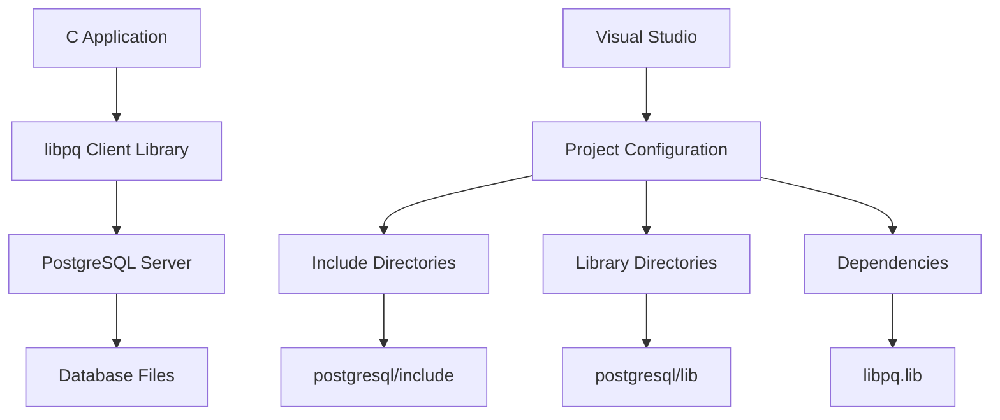
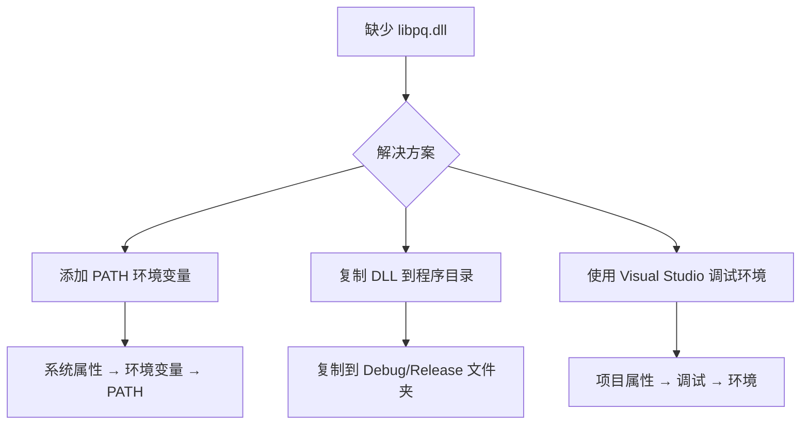

# PostgreSQL C++ Windows 安装指南
> **文档创建时间**: 2025-11-14
> **最后更新**: 2025-11-14
> **标签**: `postgresql`, `c`, `windows`, `development`, `database`, `libpq`

## 📑 目录

- [1. 概述](#1-概述)
- [2. 系统组件](#2-系统组件)
- [3. PostgreSQL 安装](#3-postgresql-安装)
  - [3.1 下载安装包](#31-下载安装包)
  - [3.2 运行安装程序](#32-运行安装程序)
- [4. C 开发环境配置](#4-c-开发环境配置)
  - [4.1 包含头文件配置](#41-包含头文件配置)
  - [4.2 链接库配置](#42-链接库配置)
  - [4.3 运行时依赖配置](#43-运行时依赖配置)
- [5. 验证与测试](#5-验证与测试)
- [6. 常见问题解决](#6-常见问题解决)
- [7. 高级配置](#7-高级配置)

---

## 1. 📖 概述

本指南详细说明如何在 Windows 系统上配置 PostgreSQL 的 C 语言开发环境，包括服务器安装、客户端库配置和开发环境设置。

### 🎯 配置目标
- ✅ 安装 PostgreSQL 数据库服务器
- ✅ 配置 C 语言客户端库 (libpq)
- ✅ 设置开发环境和编译选项
- ✅ 创建可运行的 C 数据库应用程序

### 🏗️ 系统架构



---

## 2. 🔧 系统组件

| 组件 | 主要作用 | 获取与说明 |
|------|----------|------------|
| **PostgreSQL 服务器** | 提供数据库服务核心，包含运行实例所需的所有程序 | 从官网下载安装包，通常自动安装 |
| **C客户端库 (libpq)** | C程序连接和操作PostgreSQL数据库的主要库，包含头文件和链接库 | **安装时必须勾选 "PostgreSQL C Libraries (libpq)"** |
| **Command Line Tools** | 提供 `psql` 等命令行工具，用于数据库管理和调试 | 推荐安装，便于开发和测试 |
| **pgAdmin** | 图形化管理工具，可视化管理数据库 | 可选安装，便于日常管理 |

---

## 3. 💾 PostgreSQL 安装

### 3.1 🌐 下载安装包

访问 [PostgreSQL官网下载页面](https://www.postgresql.org/download/windows/)：

**推荐版本选择**：
- **最新稳定版**: PostgreSQL 16.x
- **架构**: x64 (64位)
- **安装包格式**: Windows exe 安装程序


### 3.2 ⚙️ 运行安装程序

1. **启动安装程序**
   ```bash
   # 以管理员权限运行
   postgresql-16.1-1-windows-x64.exe
   ```

2. **组件选择界面**

   **关键步骤**：在 **"Select Components"** 界面，请确保勾选以下选项：
   ```
   ✅ PostgreSQL Server                    (必须)
   ✅ Command Line Tools                  (推荐)
   ✅ PostgreSQL C Libraries (libpq)     (必须)
   ✅ pgAdmin 4                          (可选)
   ```

3. **重要配置项**

   | 配置项 | 推荐设置 | 说明 |
   |--------|----------|------|
   **安装目录** | `C:\Program Files\PostgreSQL\16` | 默认路径，避免包含空格或中文 |
   **数据目录** | `C:\Program Files\PostgreSQL\16\data` | 数据库存储位置 |
   **超级用户密码** | 强密码 | 记住postgres用户密码 |
   **端口** | `5432` | 默认端口，确保未被占用 |
   **区域设置** | `Chinese (Simplified), China` | 或根据需要选择 |

4. **安装完成验证**
   ```bash
   # 检查服务状态
   services.msc  # 查看postgresql服务是否运行

   # 测试连接
   psql -U postgres -h localhost
   ```

---

## 4. 🛠️ C 开发环境配置

安装完成后，PostgreSQL 通常位于 `C:\Program Files\PostgreSQL\16` 目录。

### 4.1 📁 包含头文件配置

**头文件路径**: `C:\Program Files\PostgreSQL\16\include`

**关键头文件**:
```c
#include <libpq-fe.h>          // 主要的客户端接口
#include <libpq/libpq-fs.h>    // 大对象支持
#include <postgres_ext.h>      // PostgreSQL 扩展定义
```

**Visual Studio 配置**:
1. 右键项目 → 属性
2. **配置属性** → **C/C++** → **常规**
3. **附加包含目录** 添加：
   ```
   C:\Program Files\PostgreSQL\16\include
   ```

### 4.2 🔗 链接库配置

**库文件路径**: `C:\Program Files\PostgreSQL\16\lib`

**主要库文件**:
```
libpq.lib        // 主要的客户端库
ws2_32.lib       // Windows Socket 库
advapi32.lib     // Windows API 库
```

**Visual Studio 配置**:
1. **配置属性** → **链接器** → **常规**
2. **附加库目录** 添加：
   ```
   C:\Program Files\PostgreSQL\16\lib
   ```

3. **配置属性** → **链接器** → **输入**
4. **附加依赖项** 添加：
   ```
   libpq.lib;ws2_32.lib;advapi32.lib;
   ```

### 4.3 🔄 运行时依赖配置

**DLL 文件**: `C:\Program Files\PostgreSQL\16\bin\libpq.dll`

**配置方法 (三选一)**:

#### 方法一：环境变量配置 (推荐)
```cmd
# PostgreSQL C++ Windows 安装指南
setx PATH "%PATH%;C:\Program Files\PostgreSQL\16\bin"

# PostgreSQL C++ Windows 安装指南
# PostgreSQL C++ Windows 安装指南
```

#### 方法二：项目配置
```cmd
# PostgreSQL C++ Windows 安装指南
set PATH=C:\Program Files\PostgreSQL\16\bin;%PATH%
your_app.exe
```

#### 方法三：复制 DLL
```cmd
# PostgreSQL C++ Windows 安装指南
copy "C:\Program Files\PostgreSQL\16\bin\libpq.dll" "your_project_dir\Debug\"
copy "C:\Program Files\PostgreSQL\16\bin\libpq.dll" "your_project_dir\Release\"
```

---

## 5. 🧪 验证与测试

### 5.1 📄 测试程序

创建测试文件 `test_pgsql.c`:

```c
#include <stdio.h>
#include <stdlib.h>
#include <libpq-fe.h>

int main() {
    printf("🐘 PostgreSQL C Development Environment Test\n");
    printf("=============================================\n\n");

    // 1. 检查 libpq 版本
    printf("📋 libpq Library Information:\n");
    printf("   Version: %s\n", PQlibVersion());

    // 2. 连接字符串
    const char *conninfo = "host=localhost port=5432 dbname=postgres user=postgres password=your_password";

    printf("\n🔌 Attempting to connect to PostgreSQL...\n");

    // 3. 建立连接
    PGconn *conn = PQconnectdb(conninfo);

    if (PQstatus(conn) != CONNECTION_OK) {
        fprintf(stderr, "❌ Connection failed: %s\n", PQerrorMessage(conn));
        PQfinish(conn);
        return 1;
    }

    printf("✅ Connection established successfully!\n");

    // 4. 获取服务器信息
    printf("\n📊 Server Information:\n");
    printf("   Host: %s\n", PQhost(conn));
    printf("   Port: %s\n", PQport(conn));
    printf("   Database: %s\n", PQdb(conn));
    printf("   User: %s\n", PQuser(conn));

    // 5. 执行简单查询
    printf("\n🔍 Executing test query...\n");
    PGresult *res = PQexec(conn, "SELECT version() as version, current_database() as database");

    if (PQresultStatus(res) != PGRES_TUPLES_OK) {
        fprintf(stderr, "❌ Query failed: %s\n", PQerrorMessage(conn));
        PQclear(res);
        PQfinish(conn);
        return 1;
    }

    // 6. 显示查询结果
    printf("✅ Query executed successfully!\n");
    printf("📋 Query Results:\n");

    int rows = PQntuples(res);
    int cols = PQnfields(res);

    for (int i = 0; i < rows; i++) {
        for (int j = 0; j < cols; j++) {
            printf("   %s: %s\n", PQfname(res, j), PQgetvalue(res, i, j));
        }
    }

    // 7. 清理资源
    PQclear(res);
    PQfinish(conn);

    printf("\n🎉 All tests completed successfully!\n");
    printf("🚀 Your PostgreSQL C development environment is ready!\n");

    return 0;
}
```

### 5.2 🔨 编译命令

#### Visual Studio 编译
```bash
# PostgreSQL C++ Windows 安装指南
# PostgreSQL C++ Windows 安装指南
msbuild YourProject.vcxproj /p:Configuration=Debug
```

#### 命令行编译 (cl.exe)
```cmd
# PostgreSQL C++ Windows 安装指南
"C:\Program Files (x86)\Microsoft Visual Studio\2019\Enterprise\VC\Auxiliary\Build\vcvars64.bat"

# PostgreSQL C++ Windows 安装指南
cl /EHsc /I"C:\Program Files\PostgreSQL\16\include" ^
   test_pgsql.c /link ^
   /LIBPATH:"C:\Program Files\PostgreSQL\16\lib" ^
   libpq.lib ws2_32.lib advapi32.lib
```

#### GCC (MinGW) 编译
```bash
gcc -o test_pgsql test_pgsql.c ^
   -I"C:\Program Files\PostgreSQL\16\include" ^
   -L"C:\Program Files\PostgreSQL\16\lib" ^
   -lpq -lws2_32 -ladvapi32
```

### 5.3 ✅ 预期输出

```
🐘 PostgreSQL C Development Environment Test
=============================================

📋 libpq Library Information:
   Version: 160001

🔌 Attempting to connect to PostgreSQL...
✅ Connection established successfully!

📊 Server Information:
   Host: localhost
   Port: 5432
   Database: postgres
   User: postgres

🔍 Executing test query...
✅ Query executed successfully!
📋 Query Results:
   version: PostgreSQL 16.1, compiled by Visual C++ build 1938, 64-bit
   database: postgres

🎉 All tests completed successfully!
🚀 Your PostgreSQL C development environment is ready!
```

---

## 6. 🔧 常见问题解决

### 6.1 ❌ 编译错误

#### 错误: `无法打开源文件: 'libpq-fe.h'`
**解决方案**:
```cmake
# PostgreSQL C++ Windows 安装指南
# PostgreSQL C++ Windows 安装指南
include_directories("C:/Program Files/PostgreSQL/16/include")
```

#### 错误: `无法解析的外部符号 _PQconnectdb`
**解决方案**:
```cmake
# PostgreSQL C++ Windows 安装指南
# PostgreSQL C++ Windows 安装指南
link_directories("C:/Program Files/PostgreSQL/16/lib")
target_link_libraries(your_target libpq ws2_32 advapi32)
```

### 6.2 ❌ 运行时错误

#### 错误: `无法启动此程序，因为计算机中缺少 libpq.dll`
**解决方案**:


#### 错误: `connection to server at "localhost" (::1), port 5432 failed`
**解决方案**:
1. 检查 PostgreSQL 服务是否启动
2. 验证端口和主机配置
3. 检查防火墙设置

### 6.3 ❌ 权限问题

#### 错误: `FATAL: password authentication failed for user "postgres"`
**解决方案**:
1. 确认密码正确
2. 检查 `pg_hba.conf` 认证配置
3. 重置 postgres 用户密码

---

## 7. 🚀 高级配置

### 7.1 📝 CMake 配置示例

创建 `CMakeLists.txt`:

```cmake
cmake_minimum_required(VERSION 3.10)
project(PostgreSQLCTest)

# PostgreSQL C++ Windows 安装指南
set(CMAKE_C_STANDARD 99)

# PostgreSQL C++ Windows 安装指南
find_package(PostgreSQL REQUIRED)

# PostgreSQL C++ Windows 安装指南
include_directories(${PostgreSQL_INCLUDE_DIRS})

# PostgreSQL C++ Windows 安装指南
add_executable(test_pgsql test_pgsql.c)

# PostgreSQL C++ Windows 安装指南
target_link_libraries(test_pgsql ${PostgreSQL_LIBRARIES})

# PostgreSQL C++ Windows 安装指南
if(WIN32)
    target_link_libraries(test_pgsql ws2_32 advapi32)
endif()

# PostgreSQL C++ Windows 安装指南
message(STATUS "PostgreSQL version: ${PostgreSQL_VERSION}")
message(STATUS "PostgreSQL include dir: ${PostgreSQL_INCLUDE_DIRS}")
message(STATUS "PostgreSQL libraries: ${PostgreSQL_LIBRARIES}")
```

### 7.2 🔒 安全连接配置

```c
// SSL 连接示例
const char *conninfo = "host=localhost "
                      "port=5432 "
                      "dbname=postgres "
                      "user=postgres "
                      "password=your_password "
                      "sslmode=require "
                      "sslcert=client.crt "
                      "sslkey=client.key";

PGconn *conn = PQconnectdb(conninfo);

// 检查 SSL 状态
if (PQsslInUse(conn)) {
    printf("✅ SSL connection established\n");
    printf("   SSL Protocol: %s\n", PQsslAttribute(conn, "protocol"));
}
```

### 7.3 📊 性能优化配置

```c
// 连接池配置示例
#define MAX_CONNECTIONS 10

typedef struct {
    PGconn *connections[MAX_CONNECTIONS];
    int available[MAX_CONNECTIONS];
    int count;
} ConnectionPool;

ConnectionPool* create_pool(const char* conninfo) {
    ConnectionPool *pool = malloc(sizeof(ConnectionPool));
    pool->count = MAX_CONNECTIONS;

    for (int i = 0; i < MAX_CONNECTIONS; i++) {
        pool->connections[i] = PQconnectdb(conninfo);
        pool->available[i] = 1;
    }

    return pool;
}

PGconn* get_connection(ConnectionPool *pool) {
    for (int i = 0; i < pool->count; i++) {
        if (pool->available[i]) {
            pool->available[i] = 0;
            return pool->connections[i];
        }
    }
    return NULL; // 所有连接都在使用中
}
```

---

## 📊 总结

### ✅ 配置完成检查清单

- [x] PostgreSQL 服务器安装完成
- [x] C 客户端库 (libpq) 安装完成
- [x] 开发环境配置正确
- [x] 测试程序编译运行成功
- [x] 基本数据库操作正常工作
- [x] 错误处理机制完善

### 🎯 下一步建议

1. **学习 libpq API**：掌握连接管理、查询执行、结果处理
2. **实现连接池**：提高应用程序性能
3. **异步编程**：使用非阻塞操作提升响应性
4. **错误处理**：完善异常情况和资源清理
5. **事务管理**：确保数据一致性

### 📚 推荐资源

- [PostgreSQL 官方文档](https://www.postgresql.org/docs/current/libpq.html)
- [libpq C API 参考](https://www.postgresql.org/docs/current/libpq-C.html)
- [PostgreSQL 教程](https://www.postgresqltutorial.com/)
- [C 数据库编程最佳实践](https://isocpp.org/)

---

> **💡 提示**:
> - 首次配置可能需要一些时间，请耐心按照步骤操作
> - 生产环境中请使用 SSL 连接和强密码
> - 定期备份数据库和配置文件
> - 监控数据库性能和连接状态