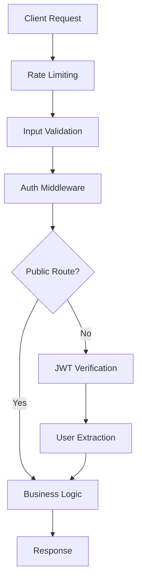

# 服务器认证 API 规范
> **文档创建时间**: 2025-11-14
> **最后更新**: 2025-11-14
> **标签**: `authentication`, `api`, `security`, `jwt`, `express`, `nodejs`, `middleware`

## 📑 目录

- [1. 概述](#1-概述)
- [2. 认证中间件](#2-认证中间件)
- [3. 认证流程](#3-认证流程)
  - [3.1 注册流程](#31-注册流程)
  - [3.2 登录流程](#32-登录流程)
  - [3.3 Token 验证流程](#33-token-验证流程)
- [4. 安全措施](#4-安全措施)
  - [4.1 输入验证](#41-输入验证)
  - [4.2 请求频率限制](#42-请求频率限制)
  - [4.3 CORS 配置](#43-cors-配置)
- [5. 用户模型](#5-用户模型)
- [6. 受保护的路由](#6-受保护的路由)
- [7. 客户端使用](#7-客户端使用)
- [8. 高级特性](#8-高级特性)
- [9. 测试与调试](#9-测试与调试)

---

## 1. 📖 概述

本指南详细说明如何实现服务器端的用户认证系统，包括注册、登录、Token 验证以及相关安全措施。

### 🎯 认证系统特性

- ✅ **JWT Token 认证**
- ✅ **密码加密存储**
- ✅ **请求频率限制**
- ✅ **输入验证和清理**
- ✅ **CORS 跨域保护**
- ✅ **错误处理和安全日志**

### 🏗️ 系统架构



---

## 2. 🔐 认证中间件

### 2.1 📄 中间件实现 (`src/middleware/auth.js`)

```javascript
const jwt = require('jsonwebtoken');
const rateLimit = require('express-rate-limit');
const helmet = require('helmet');

/**
 * JWT Token 认证中间件
 * @param {Object} req - Express 请求对象
 * @param {Object} res - Express 响应对象
 * @param {Function} next - Express 下一个中间件函数
 */
const authenticateToken = (req, res, next) => {
    try {
        // 从请求头获取 Bearer Token
        const authHeader = req.headers['authorization'];
        const token = authHeader && authHeader.split(' ')[1];

        // 验证 Token 格式
        if (!token) {
            return res.status(401).json({
                success: false,
                message: 'Access token is required',
                code: 'TOKEN_MISSING'
            });
        }

        if (!authHeader.startsWith('Bearer ')) {
            return res.status(401).json({
                success: false,
                message: 'Invalid token format. Expected: Bearer <token>',
                code: 'TOKEN_FORMAT_INVALID'
            });
        }

        // 验证 JWT Token
        jwt.verify(token, process.env.JWT_SECRET, {
            algorithms: ['HS256'],
            clockTolerance: 30 // 允许30秒时钟偏差
        }, (err, decoded) => {
            if (err) {
                console.warn(`JWT Verification failed: ${err.message}`);

                return res.status(403).json({
                    success: false,
                    message: 'Invalid or expired token',
                    code: 'TOKEN_INVALID',
                    details: err.name // 可选：生产环境可能要隐藏
                });
            }

            // 将用户信息附加到请求对象
            req.user = {
                id: decoded.userId,
                iat: decoded.iat,
                exp: decoded.exp
            };

            next();
        });

    } catch (error) {
        console.error('Authentication middleware error:', error);
        return res.status(500).json({
            success: false,
            message: 'Internal server error during authentication',
            code: 'AUTH_ERROR'
        });
    }
};

/**
 * 可选的认证中间件 - Token 可选的路由
 */
const optionalAuth = (req, res, next) => {
    const authHeader = req.headers['authorization'];
    const token = authHeader && authHeader.split(' ')[1];

    if (token) {
        authenticateToken(req, res, next);
    } else {
        next(); // 没有 Token 时继续执行
    }
};

module.exports = {
    authenticateToken,
    optionalAuth
};
```

### 2.2 🚦 请求频率限制

```javascript
/**
 * 认证相关的频率限制
 */
const authLimiter = rateLimit({
    windowMs: 15 * 60 * 1000,  // 15分钟窗口期
    max: 5,                    // 最多5次尝试
    message: {
        success: false,
        message: 'Too many authentication attempts, please try again later',
        code: 'RATE_LIMIT_EXCEEDED',
        retryAfter: '15 minutes'
    },
    standardHeaders: true,      // 返回速率限制信息在 headers
    legacyHeaders: false,      // 禁用 `X-RateLimit-*` headers
    handler: (req, res) => {
        res.status(429).json({
            success: false,
            message: 'Too many authentication attempts, please try again later',
            code: 'RATE_LIMIT_EXCEEDED',
            retryAfter: '15 minutes'
        });
    }
});

/**
 * 一般 API 的频率限制
 */
const apiLimiter = rateLimit({
    windowMs: 15 * 60 * 1000,  // 15分钟
    max: 100,                  // 最多100次请求
    message: {
        success: false,
        message: 'API rate limit exceeded',
        code: 'API_RATE_LIMIT_EXCEEDED'
    }
});

module.exports = {
    authLimiter,
    apiLimiter
};
```

---

## 3. 🔑 认证流程

### 3.1 📝 注册流程 (`/auth/register`)

```javascript
const express = require('express');
const { body, validationResult } = require('express-validator');
const bcrypt = require('bcrypt');
const router = express.Router();

// 注册验证规则
const registerValidation = [
    body('username')
        .trim()
        .isLength({ min: 3, max: 20 })
        .withMessage('Username must be 3-20 characters long')
        .matches(/^[a-zA-Z0-9_]+$/)
        .withMessage('Username can only contain letters, numbers and underscores'),

    body('email')
        .isEmail()
        .normalizeEmail()
        .withMessage('Valid email address is required'),

    body('password')
        .isLength({ min: 6 })
        .withMessage('Password must be at least 6 characters long')
        .matches(/^(?=.*\d)(?=.*[a-z])(?=.*[A-Z]).*$/)
        .withMessage('Password must contain at least one uppercase letter, one lowercase letter, and one number')
];

/**
 * 用户注册路由
 * POST /auth/register
 */
router.post('/register',
    registerValidation,  // 输入验证
    validate,            // 验证结果处理
    authLimiter,        // 请求频率限制
    async (req, res) => {
        const transaction = await pool.beginTransaction();

        try {
            const { username, password, email } = req.body;

            console.info(`Registration attempt: username=${username}, email=${email}`);

            // 1. 检查用户名是否已存在
            const [existingUser] = await pool.execute(
                'SELECT id FROM users WHERE username = ? OR email = ?',
                [username, email]
            );

            if (existingUser.length > 0) {
                await transaction.rollback();
                return res.status(400).json({
                    success: false,
                    message: existingUser[0].username === username
                        ? 'Username is already taken'
                        : 'Email is already registered',
                    code: 'USER_EXISTS'
                });
            }

            // 2. 密码加密
            const saltRounds = 12;
            const hashedPassword = await bcrypt.hash(password, saltRounds);

            // 3. 创建新用户
            const [result] = await pool.execute(
                'INSERT INTO users (username, password, email, created_at, updated_at) VALUES (?, ?, ?, NOW(), NOW())',
                [username, hashedPassword, email]
            );

            const userId = result.insertId;

            // 4. 生成 JWT Token
            const token = jwt.sign(
                {
                    userId,
                    username,
                    type: 'access'
                },
                process.env.JWT_SECRET,
                {
                    expiresIn: '24h',
                    algorithm: 'HS256',
                    issuer: 'your-app-name',
                    audience: 'your-app-users'
                }
            );

            // 5. 生成 Refresh Token (可选)
            const refreshToken = jwt.sign(
                {
                    userId,
                    type: 'refresh'
                },
                process.env.JWT_REFRESH_SECRET,
                {
                    expiresIn: '7d',
                    algorithm: 'HS256'
                }
            );

            // 6. 保存 Refresh Token 到数据库 (可选)
            await pool.execute(
                'UPDATE users SET refresh_token = ? WHERE id = ?',
                [refreshToken, userId]
            );

            await transaction.commit();

            console.info(`User registered successfully: userId=${userId}, username=${username}`);

            // 7. 返回成功响应 (不包含敏感信息)
            res.status(201).json({
                success: true,
                message: 'Registration successful',
                data: {
                    user: {
                        id: userId,
                        username: username,
                        email: email,
                        created_at: new Date().toISOString()
                    },
                    tokens: {
                        access_token: token,
                        refresh_token: refreshToken,
                        token_type: 'Bearer',
                        expires_in: 86400 // 24小时
                    }
                }
            });

        } catch (error) {
            await transaction.rollback();
            console.error('Registration error:', error);

            res.status(500).json({
                success: false,
                message: 'Registration failed due to server error',
                code: 'REGISTRATION_ERROR'
            });
        }
    }
);
```

### 3.2 🔐 登录流程 (`/auth/login`)

```javascript
/**
 * 用户登录路由
 * POST /auth/login
 */
router.post('/login',
    authLimiter,      // 请求频率限制
    [
        body('username')
            .trim()
            .notEmpty()
            .withMessage('Username or email is required'),

        body('password')
            .notEmpty()
            .withMessage('Password is required')
    ],
    validate,         // 验证结果处理
    async (req, res) => {
        try {
            const { username, password } = req.body;

            console.info(`Login attempt: username=${username}`);

            // 1. 查找用户 (支持用户名或邮箱登录)
            const [users] = await pool.execute(
                'SELECT id, username, email, password, refresh_token, failed_login_attempts, locked_until FROM users WHERE username = ? OR email = ?',
                [username, username]
            );

            if (users.length === 0) {
                return res.status(401).json({
                    success: false,
                    message: 'Invalid username or password',
                    code: 'INVALID_CREDENTIALS'
                });
            }

            const user = users[0];

            // 2. 检查账户是否被锁定
            if (user.locked_until && new Date() < new Date(user.locked_until)) {
                return res.status(423).json({
                    success: false,
                    message: 'Account is temporarily locked due to too many failed login attempts',
                    code: 'ACCOUNT_LOCKED',
                    locked_until: user.locked_until
                });
            }

            // 3. 验证密码
            const isValidPassword = await bcrypt.compare(password, user.password);

            if (!isValidPassword) {
                // 增加失败次数
                const newFailedAttempts = user.failed_login_attempts + 1;
                const lockAccount = newFailedAttempts >= 5;

                await pool.execute(
                    `UPDATE users SET
                     failed_login_attempts = ?,
                     locked_until = ?
                     WHERE id = ?`,
                    [
                        lockAccount ? 0 : newFailedAttempts,
                        lockAccount ? new Date(Date.now() + 30 * 60 * 1000) : null, // 30分钟锁定
                        user.id
                    ]
                );

                console.warn(`Failed login attempt: username=${username}, attempts=${newFailedAttempts}`);

                return res.status(401).json({
                    success: false,
                    message: 'Invalid username or password',
                    code: 'INVALID_CREDENTIALS',
                    remaining_attempts: Math.max(0, 5 - newFailedAttempts)
                });
            }

            // 4. 登录成功 - 重置失败次数
            await pool.execute(
                'UPDATE users SET failed_login_attempts = 0, locked_until = NULL, last_login = NOW() WHERE id = ?',
                [user.id]
            );

            // 5. 生成 JWT Token
            const token = jwt.sign(
                {
                    userId: user.id,
                    username: user.username,
                    type: 'access'
                },
                process.env.JWT_SECRET,
                {
                    expiresIn: '24h',
                    algorithm: 'HS256',
                    issuer: 'your-app-name',
                    audience: 'your-app-users'
                }
            );

            // 6. 生成新的 Refresh Token
            const refreshToken = jwt.sign(
                {
                    userId: user.id,
                    type: 'refresh'
                },
                process.env.JWT_REFRESH_SECRET,
                {
                    expiresIn: '7d',
                    algorithm: 'HS256'
                }
            );

            // 7. 更新 Refresh Token
            await pool.execute(
                'UPDATE users SET refresh_token = ? WHERE id = ?',
                [refreshToken, user.id]
            );

            console.info(`User logged in successfully: userId=${user.id}, username=${user.username}`);

            res.json({
                success: true,
                message: 'Login successful',
                data: {
                    user: {
                        id: user.id,
                        username: user.username,
                        email: user.email,
                        last_login: new Date().toISOString()
                    },
                    tokens: {
                        access_token: token,
                        refresh_token: refreshToken,
                        token_type: 'Bearer',
                        expires_in: 86400 // 24小时
                    }
                }
            });

        } catch (error) {
            console.error('Login error:', error);

            res.status(500).json({
                success: false,
                message: 'Login failed due to server error',
                code: 'LOGIN_ERROR'
            });
        }
    }
);
```

### 3.3 🔄 Token 刷新流程

```javascript
/**
 * 刷新访问令牌
 * POST /auth/refresh
 */
router.post('/refresh',
    async (req, res) => {
        try {
            const { refresh_token } = req.body;

            if (!refresh_token) {
                return res.status(401).json({
                    success: false,
                    message: 'Refresh token is required',
                    code: 'REFRESH_TOKEN_MISSING'
                });
            }

            // 验证 Refresh Token
            jwt.verify(refresh_token, process.env.JWT_REFRESH_SECRET, async (err, decoded) => {
                if (err) {
                    return res.status(403).json({
                        success: false,
                        message: 'Invalid refresh token',
                        code: 'REFRESH_TOKEN_INVALID'
                    });
                }

                // 检查数据库中的 Refresh Token
                const [users] = await pool.execute(
                    'SELECT id, username, refresh_token FROM users WHERE id = ?',
                    [decoded.userId]
                );

                if (users.length === 0 || users[0].refresh_token !== refresh_token) {
                    return res.status(403).json({
                        success: false,
                        message: 'Invalid refresh token',
                        code: 'REFRESH_TOKEN_MISMATCH'
                    });
                }

                // 生成新的 Access Token
                const newAccessToken = jwt.sign(
                    {
                        userId: decoded.userId,
                        username: users[0].username,
                        type: 'access'
                    },
                    process.env.JWT_SECRET,
                    {
                        expiresIn: '24h',
                        algorithm: 'HS256'
                    }
                );

                res.json({
                    success: true,
                    message: 'Token refreshed successfully',
                    data: {
                        access_token: newAccessToken,
                        token_type: 'Bearer',
                        expires_in: 86400
                    }
                });
            });

        } catch (error) {
            console.error('Token refresh error:', error);

            res.status(500).json({
                success: false,
                message: 'Token refresh failed',
                code: 'REFRESH_ERROR'
            });
        }
    }
);
```

---

## 4. 🛡️ 安全措施

### 4.1 ✅ 输入验证

```javascript
const { body, validationResult } = require('express-validator');

// 验证结果处理中间件
const validate = (req, res, next) => {
    const errors = validationResult(req);
    if (!errors.isEmpty()) {
        return res.status(400).json({
            success: false,
            message: 'Validation failed',
            code: 'VALIDATION_ERROR',
            errors: errors.array()
        });
    }
    next();
};

// 通用验证规则
const commonValidation = {
    username: [
        body('username')
            .trim()
            .isLength({ min: 3, max: 20 })
            .matches(/^[a-zA-Z0-9_]+$/)
    ],

    email: [
        body('email')
            .isEmail()
            .normalizeEmail()
    ],

    password: [
        body('password')
            .isLength({ min: 8 })
            .matches(/^(?=.*\d)(?=.*[a-z])(?=.*[A-Z])(?=.*[@$!%*?&]).*$/)
            .withMessage('Password must be at least 8 characters long and contain uppercase, lowercase, number, and special character')
    ]
};
```

### 4.2 🚦 CORS 配置

```javascript
const cors = require('cors');

const corsOptions = {
    origin: function (origin, callback) {
        const allowedOrigins = process.env.ALLOWED_ORIGINS?.split(',') || ['http://localhost:3000'];

        // 允许没有 origin 的请求 (如移动应用)
        if (!origin) return callback(null, true);

        if (allowedOrigins.includes(origin)) {
            callback(null, true);
        } else {
            callback(new Error('Not allowed by CORS'));
        }
    },

    methods: ['GET', 'POST', 'PUT', 'DELETE', 'OPTIONS'],
    allowedHeaders: ['Content-Type', 'Authorization', 'X-Requested-With'],
    credentials: true,
    optionsSuccessStatus: 200,
    maxAge: 86400 // 24小时
};

app.use(cors(corsOptions));
```

### 4.3 🔒 安全头部

```javascript
const helmet = require('helmet');

app.use(helmet({
    contentSecurityPolicy: {
        directives: {
            defaultSrc: ["'self'"],
            styleSrc: ["'self'", "'unsafe-inline'"],
            scriptSrc: ["'self'"],
            imgSrc: ["'self'", "data:", "https:"],
        },
    },

    hsts: {
        maxAge: 31536000,
        includeSubDomains: true,
        preload: true
    }
}));
```

---

## 5. 👤 用户模型

```javascript
const bcrypt = require('bcrypt');
const pool = require('../database/connection');

class User {
    /**
     * 创建用户
     * @param {string} username - 用户名
     * @param {string} password - 明文密码
     * @param {string} email - 邮箱
     * @returns {Promise<number>} 用户ID
     */
    static async createUser(username, password, email) {
        const hashedPassword = await bcrypt.hash(password, 12);

        const [result] = await pool.execute(
            'INSERT INTO users (username, password, email, created_at, updated_at) VALUES (?, ?, ?, NOW(), NOW())',
            [username, hashedPassword, email]
        );

        return result.insertId;
    }

    /**
     * 根据用户名查找用户
     * @param {string} username - 用户名
     * @returns {Promise<Object|null>} 用户对象
     */
    static async findUserByUsername(username) {
        const [users] = await pool.execute(
            'SELECT id, username, email, password, created_at, updated_at FROM users WHERE username = ?',
            [username]
        );

        return users[0] || null;
    }

    /**
     * 根据邮箱查找用户
     * @param {string} email - 邮箱
     * @returns {Promise<Object|null>} 用户对象
     */
    static async findUserByEmail(email) {
        const [users] = await pool.execute(
            'SELECT id, username, email, password, created_at, updated_at FROM users WHERE email = ?',
            [email]
        );

        return users[0] || null;
    }

    /**
     * 验证密码
     * @param {string} password - 明文密码
     * @param {string} hashedPassword - 哈希密码
     * @returns {Promise<boolean>} 验证结果
     */
    static async verifyPassword(password, hashedPassword) {
        return await bcrypt.compare(password, hashedPassword);
    }

    /**
     * 更新用户最后登录时间
     * @param {number} userId - 用户ID
     * @returns {Promise<void>}
     */
    static async updateLastLogin(userId) {
        await pool.execute(
            'UPDATE users SET last_login = NOW() WHERE id = ?',
            [userId]
        );
    }

    /**
     * 检查用户是否存在
     * @param {string} username - 用户名
     * @param {string} email - 邮箱
     * @returns {Promise<boolean>} 是否存在
     */
    static async userExists(username, email) {
        const [users] = await pool.execute(
            'SELECT id FROM users WHERE username = ? OR email = ?',
            [username, email]
        );

        return users.length > 0;
    }
}

module.exports = User;
```

---

## 6. 🛡️ 受保护的路由

```javascript
const { authenticateToken } = require('../middleware/auth');
const router = express.Router();

/**
 * 获取用户信息
 * GET /api/user/profile
 */
router.get('/profile', authenticateToken, async (req, res) => {
    try {
        const userId = req.user.id;

        const [users] = await pool.execute(
            'SELECT id, username, email, created_at, last_login FROM users WHERE id = ?',
            [userId]
        );

        if (users.length === 0) {
            return res.status(404).json({
                success: false,
                message: 'User not found',
                code: 'USER_NOT_FOUND'
            });
        }

        res.json({
            success: true,
            data: {
                user: users[0]
            }
        });

    } catch (error) {
        console.error('Profile fetch error:', error);
        res.status(500).json({
            success: false,
            message: 'Failed to fetch profile',
            code: 'PROFILE_ERROR'
        });
    }
});

/**
 * 文件上传路由
 * POST /api/files/upload
 */
router.post('/upload',
    authenticateToken,
    upload.single('file'),
    async (req, res) => {
        try {
            if (!req.file) {
                return res.status(400).json({
                    success: false,
                    message: 'No file uploaded',
                    code: 'NO_FILE_UPLOADED'
                });
            }

            // 文件处理逻辑...
            res.json({
                success: true,
                message: 'File uploaded successfully',
                data: {
                    filename: req.file.filename,
                    size: req.file.size,
                    mimetype: req.file.mimetype
                }
            });

        } catch (error) {
            console.error('File upload error:', error);
            res.status(500).json({
                success: false,
                message: 'File upload failed',
                code: 'UPLOAD_ERROR'
            });
        }
    }
);
```

---

## 7. 💻 客户端使用

### 7.1 🔐 登录示例

```javascript
class AuthClient {
    constructor(baseURL) {
        this.baseURL = baseURL;
        this.token = null;
    }

    /**
     * 用户登录
     * @param {string} username - 用户名或邮箱
     * @param {string} password - 密码
     * @returns {Promise<Object>} 登录结果
     */
    async login(username, password) {
        try {
            const response = await fetch(`${this.baseURL}/auth/login`, {
                method: 'POST',
                headers: {
                    'Content-Type': 'application/json',
                },
                body: JSON.stringify({ username, password })
            });

            const data = await response.json();

            if (data.success) {
                this.token = data.data.tokens.access_token;
                this.refreshToken = data.data.tokens.refresh_token;

                // 存储到 localStorage
                localStorage.setItem('access_token', this.token);
                localStorage.setItem('refresh_token', this.refreshToken);
            }

            return data;

        } catch (error) {
            console.error('Login error:', error);
            throw error;
        }
    }

    /**
     * 带认证的请求
     * @param {string} url - 请求URL
     * @param {Object} options - 请求选项
     * @returns {Promise<Response>} 响应对象
     */
    async authenticatedRequest(url, options = {}) {
        if (!this.token) {
            throw new Error('No authentication token available');
        }

        const defaultOptions = {
            headers: {
                'Authorization': `Bearer ${this.token}`,
                'Content-Type': 'application/json',
            },
            ...options
        };

        let response = await fetch(url, defaultOptions);

        // Token 过期时自动刷新
        if (response.status === 403) {
            await this.refreshAccessToken();
            defaultOptions.headers.Authorization = `Bearer ${this.token}`;
            response = await fetch(url, defaultOptions);
        }

        return response;
    }

    /**
     * 刷新访问令牌
     */
    async refreshAccessToken() {
        try {
            const response = await fetch(`${this.baseURL}/auth/refresh`, {
                method: 'POST',
                headers: {
                    'Content-Type': 'application/json',
                },
                body: JSON.stringify({
                    refresh_token: this.refreshToken
                })
            });

            const data = await response.json();

            if (data.success) {
                this.token = data.data.access_token;
                localStorage.setItem('access_token', this.token);
            } else {
                throw new Error('Token refresh failed');
            }

        } catch (error) {
            console.error('Token refresh error:', error);
            this.logout();
            throw error;
        }
    }

    /**
     * 用户登出
     */
    logout() {
        this.token = null;
        this.refreshToken = null;
        localStorage.removeItem('access_token');
        localStorage.removeItem('refresh_token');
    }
}

// 使用示例
const authClient = new AuthClient('http://localhost:3000/api');

// 登录
const loginResult = await authClient.login('username', 'password');

// 发送认证请求
const profileResponse = await authClient.authenticatedRequest('/user/profile');
const profileData = await profileResponse.json();
```

---

## 8. 🚀 高级特性

### 8.1 🔄 双因素认证 (2FA)

```javascript
const speakeasy = require('speakeasy');
const qrcode = require('qrcode');

/**
 * 启用双因素认证
 */
router.post('/2fa/enable', authenticateToken, async (req, res) => {
    try {
        const userId = req.user.id;

        // 生成密钥
        const secret = speakeasy.generateSecret({
            name: `YourApp (${req.user.username})`,
            issuer: 'YourApp',
            length: 32
        });

        // 保存密钥到数据库 (未验证状态)
        await pool.execute(
            'UPDATE users SET two_factor_secret = ?, two_factor_enabled = FALSE WHERE id = ?',
            [secret.base32, userId]
        );

        // 生成二维码
        const qrCodeUrl = await qrcode.toDataURL(secret.otpauth_url);

        res.json({
            success: true,
            message: '2FA setup initiated',
            data: {
                secret: secret.base32,
                qr_code: qrCodeUrl,
                backup_codes: generateBackupCodes()
            }
        });

    } catch (error) {
        console.error('2FA enable error:', error);
        res.status(500).json({
            success: false,
            message: 'Failed to enable 2FA',
            code: 'TWO_FA_ENABLE_ERROR'
        });
    }
});

/**
 * 验证双因素认证
 */
router.post('/2fa/verify', authenticateToken, async (req, res) => {
    try {
        const { token } = req.body;
        const userId = req.user.id;

        // 获取用户的密钥
        const [users] = await pool.execute(
            'SELECT two_factor_secret FROM users WHERE id = ?',
            [userId]
        );

        if (users.length === 0 || !users[0].two_factor_secret) {
            return res.status(400).json({
                success: false,
                message: '2FA not set up for this user',
                code: 'TWO_FA_NOT_SETUP'
            });
        }

        // 验证令牌
        const verified = speakeasy.totp.verify({
            secret: users[0].two_factor_secret,
            encoding: 'base32',
            token: token,
            window: 2 // 允许2个时间窗口的偏差
        });

        if (!verified) {
            return res.status(400).json({
                success: false,
                message: 'Invalid 2FA token',
                code: 'TWO_FA_INVALID_TOKEN'
            });
        }

        // 启用双因素认证
        await pool.execute(
            'UPDATE users SET two_factor_enabled = TRUE WHERE id = ?',
            [userId]
        );

        res.json({
            success: true,
            message: '2FA enabled successfully'
        });

    } catch (error) {
        console.error('2FA verification error:', error);
        res.status(500).json({
            success: false,
            message: 'Failed to verify 2FA',
            code: 'TWO_FA_VERIFY_ERROR'
        });
    }
});
```

### 8.2 📝 审计日志

```javascript
/**
 * 记录安全事件
 */
async function logSecurityEvent(userId, eventType, details, ipAddress, userAgent) {
    try {
        await pool.execute(
            `INSERT INTO security_logs
             (user_id, event_type, details, ip_address, user_agent, created_at)
             VALUES (?, ?, ?, ?, ?, NOW())`,
            [userId, eventType, JSON.stringify(details), ipAddress, userAgent]
        );
    } catch (error) {
        console.error('Failed to log security event:', error);
    }
}

// 在认证路由中使用
router.post('/login', authLimiter, async (req, res) => {
    const ipAddress = req.ip;
    const userAgent = req.get('User-Agent');

    // ... 登录逻辑 ...

    if (loginSuccessful) {
        await logSecurityEvent(
            user.id,
            'LOGIN_SUCCESS',
            { username },
            ipAddress,
            userAgent
        );
    } else {
        await logSecurityEvent(
            null, // 未知用户
            'LOGIN_FAILED',
            { username, reason: 'invalid_credentials' },
            ipAddress,
            userAgent
        );
    }
});
```

---

## 9. 🧪 测试与调试

### 9.1 🧪 单元测试

```javascript
const request = require('supertest');
const app = require('../app');
const pool = require('../database/connection');

describe('Authentication API', () => {
    beforeEach(async () => {
        // 清理测试数据
        await pool.execute('DELETE FROM users WHERE username LIKE "test_%"');
    });

    afterAll(async () => {
        // 关闭数据库连接
        await pool.end();
    });

    describe('POST /auth/register', () => {
        it('should register a new user successfully', async () => {
            const userData = {
                username: 'test_user',
                email: 'test@example.com',
                password: 'TestPass123!'
            };

            const response = await request(app)
                .post('/auth/register')
                .send(userData)
                .expect(201);

            expect(response.body.success).toBe(true);
            expect(response.body.data.user.username).toBe(userData.username);
            expect(response.body.data.tokens.access_token).toBeDefined();
        });

        it('should reject duplicate username', async () => {
            const userData = {
                username: 'test_user',
                email: 'test@example.com',
                password: 'TestPass123!'
            };

            // 第一次注册成功
            await request(app)
                .post('/auth/register')
                .send(userData)
                .expect(201);

            // 第二次注册失败
            const response = await request(app)
                .post('/auth/register')
                .send(userData)
                .expect(400);

            expect(response.body.success).toBe(false);
            expect(response.body.code).toBe('USER_EXISTS');
        });
    });

    describe('POST /auth/login', () => {
        beforeEach(async () => {
            // 创建测试用户
            await request(app)
                .post('/auth/register')
                .send({
                    username: 'test_user',
                    email: 'test@example.com',
                    password: 'TestPass123!'
                });
        });

        it('should login with valid credentials', async () => {
            const response = await request(app)
                .post('/auth/login')
                .send({
                    username: 'test_user',
                    password: 'TestPass123!'
                })
                .expect(200);

            expect(response.body.success).toBe(true);
            expect(response.body.data.tokens.access_token).toBeDefined();
        });

        it('should reject invalid credentials', async () => {
            const response = await request(app)
                .post('/auth/login')
                .send({
                    username: 'test_user',
                    password: 'wrongpassword'
                })
                .expect(401);

            expect(response.body.success).toBe(false);
            expect(response.body.code).toBe('INVALID_CREDENTIALS');
        });
    });
});
```

### 9.2 🔍 调试工具

```javascript
// Token 调试工具
const jwt = require('jsonwebtoken');

function debugToken(token) {
    try {
        const decoded = jwt.decode(token, { complete: true });

        console.log('Token Debug Info:');
        console.log('Header:', decoded.header);
        console.log('Payload:', decoded.payload);
        console.log('Signature:', decoded.signature);

        // 验证 token
        const verified = jwt.verify(token, process.env.JWT_SECRET);
        console.log('Verification:', '✅ Valid');
        console.log('Expiration:', new Date(verified.exp * 1000));

    } catch (error) {
        console.log('Verification:', '❌ Invalid');
        console.log('Error:', error.message);
    }
}

// 使用方式
debugToken('your.jwt.token.here');
```

---

## 📊 总结

### ✅ 认证系统特性

- ✅ **安全的密码存储** (bcrypt)
- ✅ **JWT Token 认证**
- ✅ **请求频率限制**
- ✅ **输入验证和清理**
- ✅ **CORS 跨域保护**
- ✅ **错误处理和安全日志**
- ✅ **双因素认证支持**
- ✅ **审计日志记录**

### 🎯 安全最佳实践

1. **使用 HTTPS** - 所有认证请求必须通过 HTTPS
2. **密码策略** - 强制使用复杂密码
3. **Token 管理** - 合理设置过期时间
4. **监控日志** - 记录所有安全相关事件
5. **定期更新** - 保持依赖库最新版本

### 📚 扩展建议

- 实现密码重置功能
- 添加账户邮箱验证
- 实现社交登录集成
- 添加设备管理功能
- 实现细粒度权限控制

---

> **💡 提示**: 在生产环境中，请确保：
> - 使用强密钥和定期轮换
> - 启用详细的日志记录
> - 实施监控和告警机制
> - 定期进行安全审计