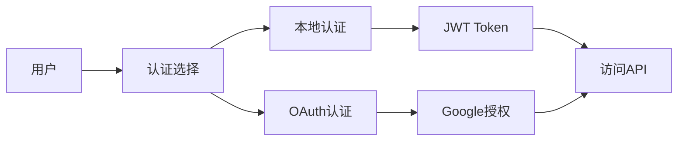
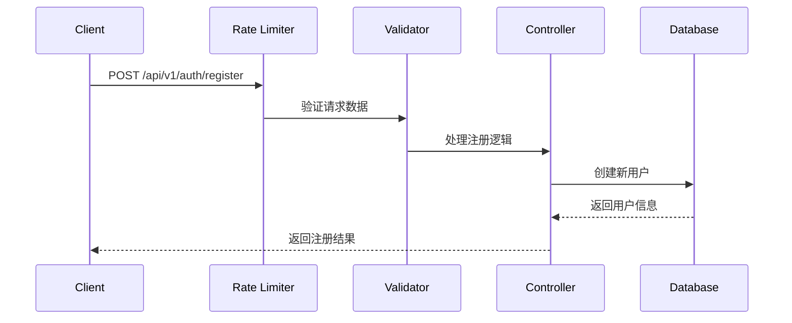
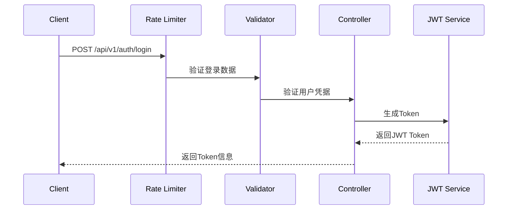
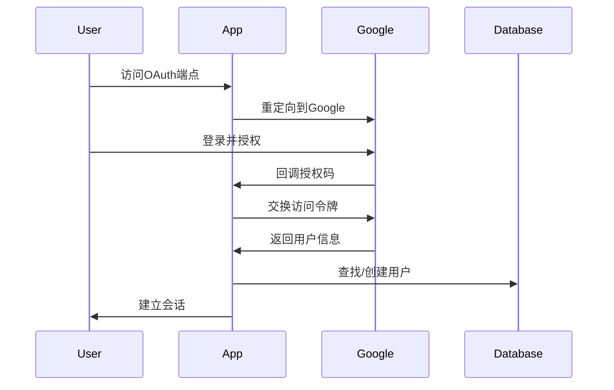
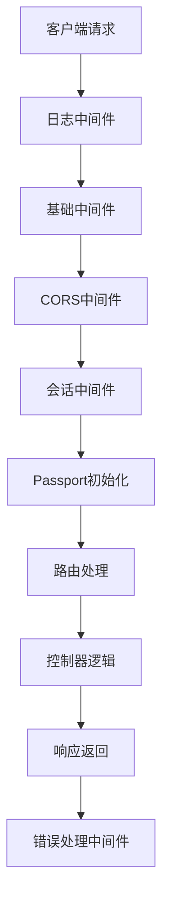

# 认证系统架构
> **文档创建时间**: 2025-11-14
> **最后更新**: 2025-11-14
> **标签**: `authentication`, `authorization`, `jwt`, `oauth`, `security`, `api`

## 📑 目录

- [1. 认证方式概述](#1-认证方式概述)
- [2. 本地认证流程](#2-本地认证流程)
  - [2.1 注册流程](#21-注册流程)
  - [2.2 登录流程](#22-登录流程)
  - [2.3 Token 验证流程](#23-token-验证流程)
- [3. Google OAuth 认证流程](#3-google-oauth-认证流程)
  - [3.1 配置](#31-配置)
  - [3.2 认证流程](#32-认证流程)
  - [3.3 会话管理](#33-会话管理)
- [4. 安全特性](#4-安全特性)
  - [4.1 速率限制](#41-速率限制)
  - [4.2 CORS 配置](#42-cors-配置)
  - [4.3 错误处理](#43-错误处理)
- [5. 中间件链](#5-中间件链)
- [6. 环境配置](#6-环境配置)

---

## 1. 认证方式概述

系统支持两种主要的认证方式：

1. **🔑 本地用户名密码认证**（JWT Token）
2. **🌐 Google OAuth 2.0 认证**



---

## 2. 本地认证流程

### 2.1 🔧 注册流程

1. 客户端发送 `POST` 请求到 `/api/v1/auth/register`
2. 请求经过速率限制中间件（Rate Limiter）检查
3. 通过注册验证器（registerValidator）验证请求数据
4. 控制器处理注册逻辑，创建新用户
5. 返回注册结果



### 2.2 🔐 登录流程

1. 客户端发送 `POST` 请求到 `/api/v1/auth/login`
2. 请求经过速率限制中间件检查
3. 通过登录验证器（loginValidator）验证请求数据
4. 控制器验证用户名和密码
5. 生成 JWT Token（有效期24小时）
6. 返回 Token 给客户端



### 2.3 🛡️ Token 验证流程

1. 客户端在请求头中携带 Token：`Authorization: Bearer <token>`
2. `authenticateToken` 中间件验证 Token：
   - 检查 Token 是否存在
   - 验证 Token 有效性
   - 从 Token 中解析用户信息
   - 将用户信息附加到请求对象

```javascript
// Token 验证中间件示例
const authenticateToken = (req, res, next) => {
  const authHeader = req.headers['authorization'];
  const token = authHeader && authHeader.split(' ')[1];

  if (!token) {
    return res.status(401).json({ error: 'Access token required' });
  }

  jwt.verify(token, process.env.JWT_SECRET, (err, user) => {
    if (err) {
      return res.status(403).json({ error: 'Invalid or expired token' });
    }
    req.user = user;
    next();
  });
};
```

---

## 3. Google OAuth 认证流程

### 3.1 ⚙️ 配置

- 使用 Passport.js 的 Google 策略
- 配置了 Google Client ID 和 Secret
- 设置了回调 URL

```javascript
// Google OAuth 配置示例
const GoogleStrategy = require('passport-google-oauth20').Strategy;

passport.use(new GoogleStrategy({
  clientID: process.env.GOOGLE_CLIENT_ID,
  clientSecret: process.env.GOOGLE_CLIENT_SECRET,
  callbackURL: "/api/v1/auth/google/callback"
}, (accessToken, refreshToken, profile, done) => {
  // 用户验证逻辑
}));
```

### 3.2 🔄 认证流程

1. 用户访问 `/api/v1/auth/oauth/google`
2. 重定向到 Google 登录页面
3. 用户授权后，Google 重定向回回调 URL
4. Passport 处理回调：
   - 验证用户信息
   - 如果用户不存在，创建新用户
   - 生成会话



### 3.3 📋 会话管理

- 使用 `express-session` 管理会话
- 配置了会话密钥和选项
- 实现了用户序列化和反序列化

```javascript
// 会话配置示例
app.use(session({
  secret: process.env.SESSION_SECRET,
  resave: false,
  saveUninitialized: false,
  cookie: {
    secure: process.env.NODE_ENV === 'production',
    maxAge: 24 * 60 * 60 * 1000 // 24小时
  }
}));
```

---

## 4. 安全特性

### 4.1 🚦 速率限制

- 使用 `express-rate-limit` 实现
- 默认限制：15分钟内每个 IP 最多 100 个请求
- 应用于登录和注册接口

```javascript
// 速率限制配置示例
const rateLimiter = rateLimit({
  windowMs: 15 * 60 * 1000, // 15分钟
  max: 100, // 最大请求数
  message: 'Too many requests from this IP'
});
```

### 4.2 🌐 CORS 配置

- 可配置允许的源（默认允许所有）
- 限制允许的 HTTP 方法
- 配置允许的请求头
- 支持凭证（credentials）

```javascript
// CORS 配置示例
app.use(cors({
  origin: process.env.ALLOWED_ORIGINS?.split(',') || '*',
  methods: ['GET', 'POST', 'PUT', 'DELETE'],
  allowedHeaders: ['Content-Type', 'Authorization'],
  credentials: true
}));
```

### 4.3 ⚠️ 错误处理

- 统一的错误处理中间件
- 区分开发环境和生产环境的错误响应
- 详细的错误日志记录

```javascript
// 错误处理中间件示例
app.use((err, req, res, next) => {
  console.error(err.stack);

  if (process.env.NODE_ENV === 'development') {
    res.status(500).json({
      error: err.message,
      stack: err.stack
    });
  } else {
    res.status(500).json({
      error: 'Internal Server Error'
    });
  }
});
```

---

## 5. 🔗 中间件链

请求处理流程：



1. **日志中间件**（请求记录）
2. **基础中间件**（JSON解析、CORS等）
3. **会话中间件**
4. **Passport 初始化**
5. **路由处理**
6. **错误处理中间件**

---

## 6. 🛠️ 环境配置

关键配置项：

```env
# 认证系统架构
JWT_SECRET=your-super-secret-jwt-key
JWT_EXPIRES_IN=24h

# 认证系统架构
SESSION_SECRET=your-session-secret

# 认证系统架构
GOOGLE_CLIENT_ID=your-google-client-id
GOOGLE_CLIENT_SECRET=your-google-client-secret

# 认证系统架构
DB_HOST=localhost
DB_PORT=3306
DB_NAME=your-database-name
DB_USER=your-username
DB_PASSWORD=your-password

# 认证系统架构
UPLOAD_DIR=./uploads
MAX_FILE_SIZE=10485760

# 认证系统架构
ALLOWED_ORIGINS=http://localhost:3000,https://yourdomain.com

# 认证系统架构
RATE_LIMIT_WINDOW_MS=900000
RATE_LIMIT_MAX_REQUESTS=100
```

---

## 📊 总结

这个认证系统采用了多重安全机制，包括：

- ✅ **JWT Token** 认证
- ✅ **OAuth 2.0** 第三方登录
- ✅ **速率限制** 防止暴力攻击
- ✅ **CORS** 跨域保护
- ✅ **统一错误处理** 提升用户体验

通过中间件链的方式，实现了灵活的认证流程控制，能够有效保护 API 接口的安全。

---

> **💡 提示**: 在生产环境中，请确保：
> - 使用强密码作为密钥
> - 启用 HTTPS
> - 定期轮换密钥
> - 监控异常访问行为