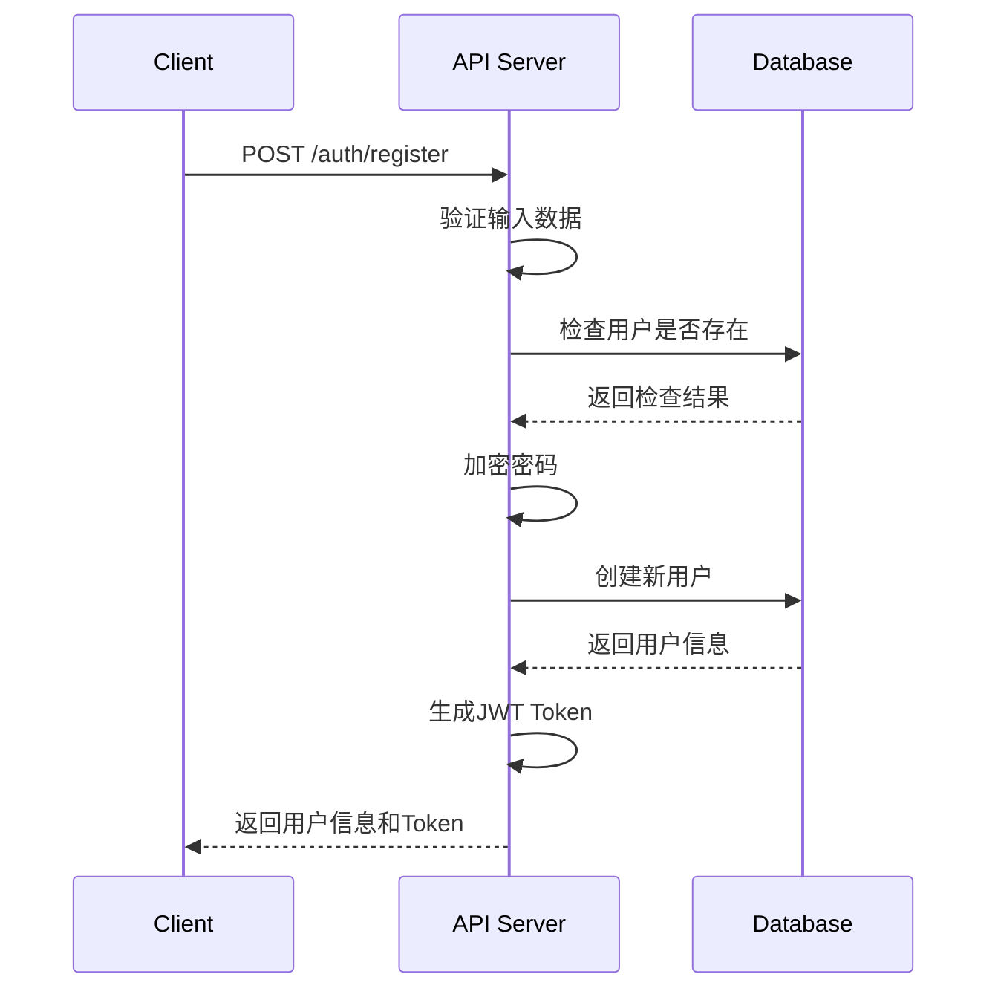
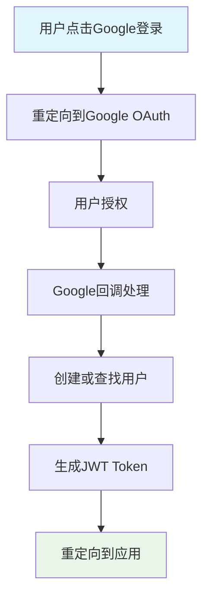
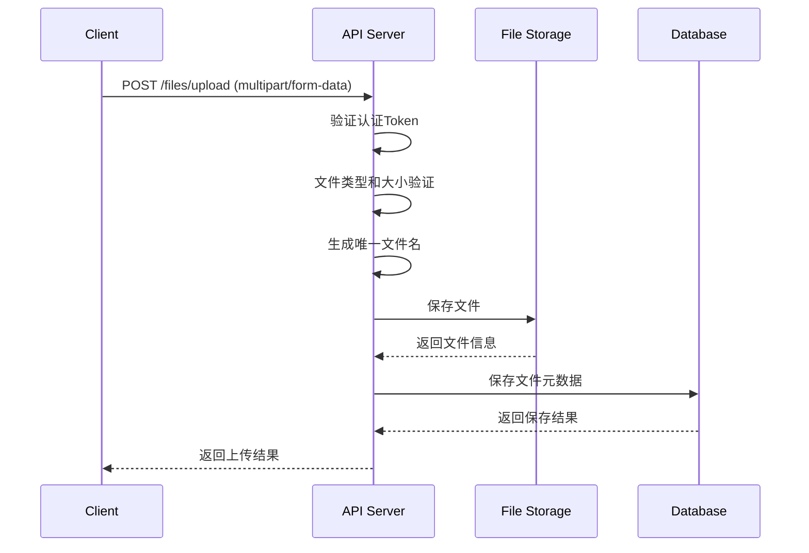
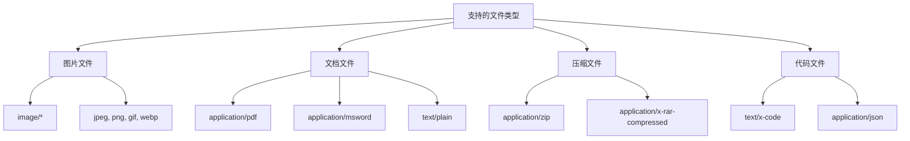
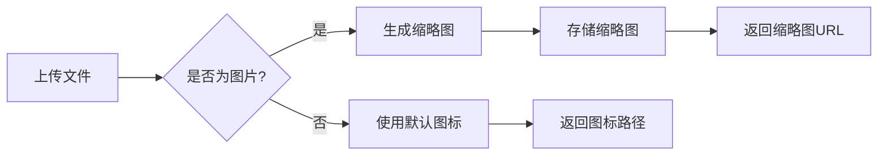
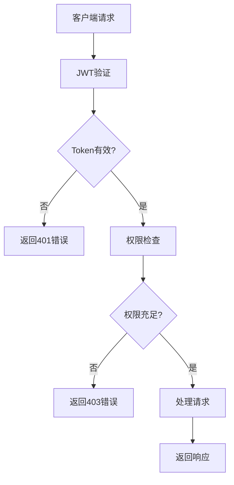
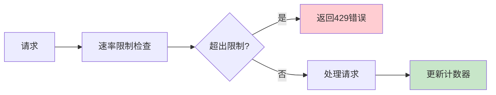
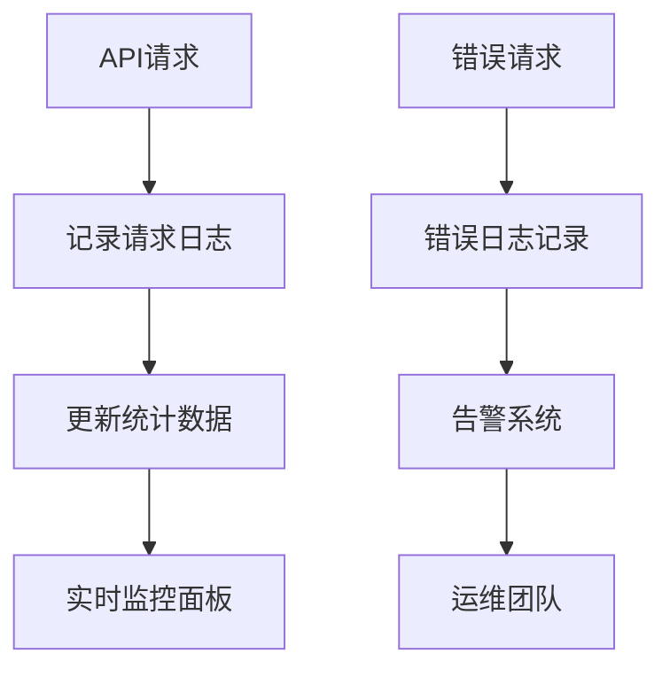

# 文件管理 API 规范
> **文档创建时间**: 2025-11-14
> **最后更新**: 2025-11-14
> **版本**: v1.0
> **标签**: `api`, `rest`, `file-management`, `authentication`, `swagger`

## 📑 目录

- [1. 基础信息](#1-基础信息)
- [2. 认证与授权](#2-认证与授权)
- [3. 文件管理](#3-文件管理)
- [4. 文件支持](#4-文件支持)
- [5. 错误处理](#5-错误处理)
- [6. 安全机制](#6-安全机制)
- [7. 速率限制](#7-速率限制)
- [8. OpenAPI 规范](#8-openapi-规范)

---

## 1. 📋 基础信息

| 项目 | 说明 |
|------|------|
| **Base URL** | `/api/v1` |
| **协议** | HTTPS |
| **数据格式** | JSON |
| **认证方式** | JWT Bearer Token |
| **API 版本** | v1.0 |

### 🔐 认证请求格式

```http
GET /api/v1/files/list HTTP/1.1
Host: your-domain.com
Authorization: Bearer <jwt_token>
Content-Type: application/json
```

---

## 2. 🔐 认证与授权

### 2.1 👤 用户注册



#### 接口详情

**请求**:
```http
POST /api/v1/auth/register
Content-Type: application/json
```

**请求体**:
```json
{
    "username": "string",
    "email": "user@example.com",
    "password": "string",
    "confirmPassword": "string"
}
```

**验证规则**:
```javascript
{
    "username": {
        "required": true,
        "minLength": 3,
        "maxLength": 20,
        "pattern": "^[a-zA-Z0-9_]+$"
    },
    "email": {
        "required": true,
        "format": "email"
    },
    "password": {
        "required": true,
        "minLength": 8,
        "pattern": "^(?=.*[a-z])(?=.*[A-Z])(?=.*\\d)(?=.*[@$!%*?&])[A-Za-z\\d@$!%*?&]"
    }
}
```

**成功响应 (201)**:
```json
{
    "success": true,
    "message": "注册成功",
    "data": {
        "user": {
            "id": "uuid",
            "username": "string",
            "email": "user@example.com",
            "createdAt": "2025-11-14T10:00:00Z"
        },
        "token": "eyJhbGciOiJIUzI1NiIsInR5cCI6IkpXVCJ9..."
    }
}
```

### 2.2 🔑 用户登录

**请求**:
```http
POST /api/v1/auth/login
Content-Type: application/json
```

**请求体**:
```json
{
    "username": "string",
    "password": "string"
}
```

**成功响应 (200)**:
```json
{
    "success": true,
    "message": "登录成功",
    "data": {
        "user": {
            "id": "uuid",
            "username": "string",
            "email": "user@example.com",
            "lastLoginAt": "2025-11-14T10:00:00Z"
        },
        "token": "eyJhbGciOiJIUzI1NiIsInR5cCI6IkpXVCJ9...",
        "expiresIn": 86400
    }
}
```

### 2.3 🌐 OAuth 集成



---

## 3. 📁 文件管理

### 3.1 📤 单文件上传



#### 接口详情

**请求**:
```http
POST /api/v1/files/upload
Authorization: Bearer <token>
Content-Type: multipart/form-data
```

**请求体**:
```
file: <binary_data>
```

**成功响应 (200)**:
```json
{
    "success": true,
    "message": "文件上传成功",
    "data": {
        "file": {
            "id": "uuid",
            "name": "document.pdf",
            "originalName": "我的文档.pdf",
            "size": 1048576,
            "mimeType": "application/pdf",
            "path": "/uploads/2025/11/14/uuid-document.pdf",
            "uploadTime": "2025-11-14T10:00:00Z",
            "checksum": "sha256:abc123..."
        }
    }
}
```

### 3.2 📦 多文件上传

**请求**:
```http
POST /api/v1/files/multi-upload
Authorization: Bearer <token>
Content-Type: multipart/form-data
```

**限制**:
- 最大文件数量: 10个
- 单文件最大大小: 100MB
- 总大小限制: 500MB

**成功响应 (200)**:
```json
{
    "success": true,
    "message": "文件上传成功",
    "data": {
        "uploaded": [
            {
                "id": "uuid1",
                "name": "file1.pdf",
                "size": 1048576,
                "path": "/uploads/uuid1-file1.pdf"
            },
            {
                "id": "uuid2",
                "name": "file2.jpg",
                "size": 2097152,
                "path": "/uploads/uuid2-file2.jpg"
            }
        ],
        "failed": [],
        "summary": {
            "total": 2,
            "uploaded": 2,
            "failed": 0,
            "totalSize": 3145728
        }
    }
}
```

### 3.3 📋 获取文件列表

**请求**:
```http
GET /api/v1/files/list?page=1&limit=20&sort=name&order=asc
Authorization: Bearer <token>
```

**查询参数**:
| 参数 | 类型 | 默认值 | 说明 |
|------|------|--------|------|
| `page` | integer | 1 | 页码 |
| `limit` | integer | 20 | 每页数量 (1-100) |
| `sort` | string | name | 排序字段 (name, size, uploadTime) |
| `order` | string | desc | 排序方向 (asc, desc) |
| `search` | string | - | 搜索文件名 |
| `type` | string | - | 文件类型过滤 |

**成功响应 (200)**:
```json
{
    "success": true,
    "message": "Success",
    "data": {
        "files": [
            {
                "id": "uuid",
                "name": "document.pdf",
                "size": 1048576,
                "mimeType": "application/pdf",
                "path": "/api/v1/files/download/uuid-document.pdf",
                "uploadTime": "2025-11-14T10:00:00Z",
                "downloadCount": 5,
                "thumbnail": "/api/v1/files/thumbnail/uuid-document.jpg"
            }
        ],
        "pagination": {
            "page": 1,
            "limit": 20,
            "total": 100,
            "totalPages": 5,
            "hasNext": true,
            "hasPrev": false
        },
        "stats": {
            "totalFiles": 100,
            "totalSize": 1073741824,
            "totalDownloads": 1250
        }
    }
}
```

### 3.4 ⬇️ 文件下载

**请求**:
```http
GET /api/v1/files/download/:filename
Authorization: Bearer <token>
```

**URL 参数**:
- `filename`: 文件名或文件ID

**功能特性**:
- ✅ 支持断点续传
- ✅ 下载统计
- ✅ 访问权限验证
- ✅ 下载日志记录

**响应头**:
```http
Content-Type: application/octet-stream
Content-Disposition: attachment; filename="document.pdf"
Content-Length: 1048576
Accept-Ranges: bytes
ETag: "abc123..."
Last-Modified: Wed, 14 Nov 2025 10:00:00 GMT
```

---

## 4. 📎 文件支持

### 4.1 🎨 允许的文件类型



**详细MIME类型列表**:
```json
{
    "images": ["image/jpeg", "image/png", "image/gif", "image/webp", "image/svg+xml"],
    "documents": [
        "application/pdf",
        "application/msword",
        "application/vnd.openxmlformats-officedocument.wordprocessingml.document",
        "application/vnd.ms-excel",
        "application/vnd.openxmlformats-officedocument.spreadsheetml.sheet",
        "text/plain",
        "text/markdown"
    ],
    "archives": [
        "application/zip",
        "application/x-rar-compressed",
        "application/x-7z-compressed"
    ],
    "code": [
        "text/x-code",
        "application/json",
        "text/xml",
        "application/xml"
    ]
}
```

### 4.2 📏 文件大小限制

| 文件类型 | 最大大小 | 说明 |
|----------|----------|------|
| **图片文件** | 50MB | JPEG, PNG, GIF等 |
| **PDF文档** | 100MB | PDF文档 |
| **Office文档** | 100MB | Word, Excel, PowerPoint |
| **压缩文件** | 200MB | ZIP, RAR, 7Z |
| **其他文件** | 50MB | 其他允许的类型 |

### 4.3 🖼️ 缩略图生成



**缩略图规格**:
- **尺寸**: 200x200 像素
- **格式**: JPEG
- **质量**: 85%
- **存储路径**: `/thumbnails/{file_id}.jpg`

---

## 5. ❌ 错误处理

### 5.1 📊 标准错误响应格式

```json
{
    "success": false,
    "error": {
        "code": "ERROR_CODE",
        "message": "用户友好的错误描述",
        "details": "详细错误信息（开发环境）",
        "timestamp": "2025-11-14T10:00:00Z",
        "path": "/api/v1/files/upload"
    },
    "requestId": "uuid-for-tracking"
}
```

### 5.2 📋 HTTP 状态码

| 状态码 | 说明 | 示例场景 |
|--------|------|----------|
| **200** | 成功 | 文件上传成功 |
| **201** | 创建成功 | 用户注册成功 |
| **400** | 请求错误 | 参数验证失败 |
| **401** | 未认证 | Token无效或过期 |
| **403** | 权限不足 | 访问他人文件 |
| **404** | 资源不存在 | 文件不存在 |
| **409** | 冲突 | 用户名已存在 |
| **413** | 文件过大 | 超过大小限制 |
| **415** | 不支持的类型 | 文件类型不允许 |
| **422** | 验证失败 | 业务逻辑验证失败 |
| **429** | 请求过多 | 超出速率限制 |
| **500** | 服务器错误 | 内部服务器错误 |

### 5.3 🔧 错误代码定义

```javascript
const ErrorCodes = {
    // 认证相关
    AUTH_TOKEN_MISSING: 'AUTH_001',
    AUTH_TOKEN_INVALID: 'AUTH_002',
    AUTH_TOKEN_EXPIRED: 'AUTH_003',

    // 用户相关
    USER_NOT_FOUND: 'USER_001',
    USER_ALREADY_EXISTS: 'USER_002',
    USER_CREDENTIALS_INVALID: 'USER_003',

    // 文件相关
    FILE_NOT_FOUND: 'FILE_001',
    FILE_TOO_LARGE: 'FILE_002',
    FILE_TYPE_NOT_ALLOWED: 'FILE_003',
    FILE_UPLOAD_FAILED: 'FILE_004',

    // 系统相关
    RATE_LIMIT_EXCEEDED: 'SYS_001',
    MAINTENANCE_MODE: 'SYS_002',
    QUOTA_EXCEEDED: 'SYS_003'
};
```

---

## 6. 🔒 安全机制

### 6.1 🛡️ 认证与授权



#### JWT Token 结构
```json
{
    "header": {
        "alg": "HS256",
        "typ": "JWT"
    },
    "payload": {
        "sub": "user_id",
        "username": "string",
        "email": "user@example.com",
        "role": "user",
        "iat": 1640000000,
        "exp": 1640086400
    }
}
```

### 6.2 🔐 密码安全

```javascript
// 密码加密示例
const bcrypt = require('bcrypt');

const hashPassword = async (password) => {
    const saltRounds = 12;
    return await bcrypt.hash(password, saltRounds);
};

const verifyPassword = async (password, hash) => {
    return await bcrypt.compare(password, hash);
};
```

### 6.3 📝 输入验证

**文件名验证**:
```javascript
{
    "filename": {
        "required": true,
        "pattern": "^[a-zA-Z0-9._-]+$",
        "maxLength": 255,
        "sanitize": true
    }
}
```

**SQL注入防护**:
- 使用参数化查询
- 输入转义和过滤
- 最小权限原则

---

## 7. ⏱️ 速率限制

### 7.1 🚦 限制策略



### 7.2 📊 限制规则

| 端点类型 | 时间窗口 | 最大请求数 | 说明 |
|----------|----------|------------|------|
| **认证相关** | 15分钟 | 5次/IP | 登录、注册 |
| **文件上传** | 1小时 | 50次/用户 | 单文件上传 |
| **文件下载** | 1小时 | 200次/用户 | 文件下载 |
| **其他API** | 15分钟 | 100次/IP | 一般请求 |

### 7.3 📈 限制响应头

```http
HTTP/1.1 429 Too Many Requests
X-RateLimit-Limit: 5
X-RateLimit-Remaining: 0
X-RateLimit-Reset: 1640090000
Retry-After: 900
```

---

## 8. 📋 OpenAPI 规范

### 8.1 🔍 Swagger 配置

```yaml
openapi: 3.0.0
info:
  title: 文件管理系统 API
  description: 基于JWT认证的文件管理系统API文档
  version: 1.0.0
  contact:
    name: API Support
    email: support@example.com
  license:
    name: MIT
    url: https://opensource.org/licenses/MIT

servers:
  - url: https://api.example.com/api/v1
    description: 生产环境
  - url: https://dev-api.example.com/api/v1
    description: 开发环境

security:
  - bearerAuth: []

components:
  securitySchemes:
    bearerAuth:
      type: http
      scheme: bearer
      bearerFormat: JWT
```

### 8.2 📝 API 文档生成

**访问 Swagger UI**:
- 生产环境: `https://api.example.com/docs`
- 开发环境: `https://dev-api.example.com/docs`

**下载 OpenAPI 规范**:
```bash
curl -o api-spec.json https://api.example.com/api-spec
```

---

## 📊 API 使用统计

### 9.1 📈 使用情况监控



### 9.2 🔍 分析指标

| 指标 | 说明 | 用途 |
|------|------|------|
| **请求量** | API调用次数 | 性能分析 |
| **响应时间** | 平均响应时间 | 性能优化 |
| **错误率** | 4xx/5xx错误比例 | 系统稳定性 |
| **并发用户** | 同时在线用户数 | 容量规划 |

---

## 📚 客户端集成

### 10.1 🖥️ JavaScript 客户端示例

```javascript
class FileManagerAPI {
    constructor(baseURL) {
        this.baseURL = baseURL;
        this.token = null;
    }

    setToken(token) {
        this.token = token;
    }

    async request(method, endpoint, data = null, options = {}) {
        const config = {
            method,
            headers: {
                'Content-Type': 'application/json',
                ...options.headers
            }
        };

        if (this.token) {
            config.headers.Authorization = `Bearer ${this.token}`;
        }

        if (data) {
            config.body = JSON.stringify(data);
        }

        const response = await fetch(`${this.baseURL}${endpoint}`, config);
        return await response.json();
    }

    // 用户登录
    async login(username, password) {
        const result = await this.request('POST', '/auth/login', {
            username,
            password
        });

        if (result.success) {
            this.setToken(result.data.token);
        }

        return result;
    }

    // 上传文件
    async uploadFile(file) {
        const formData = new FormData();
        formData.append('file', file);

        const response = await fetch(`${this.baseURL}/files/upload`, {
            method: 'POST',
            headers: {
                'Authorization': `Bearer ${this.token}`
            },
            body: formData
        });

        return await response.json();
    }

    // 获取文件列表
    async getFiles(page = 1, limit = 20) {
        return await this.request('GET', `/files/list?page=${page}&limit=${limit}`);
    }
}

// 使用示例
const api = new FileManagerAPI('https://api.example.com/api/v1');
```

---

## 📋 总结

### ✅ API 特性总览

- 🔐 **安全认证**: JWT Token 认证机制
- 📁 **文件管理**: 完整的文件上传下载功能
- 🎯 **权限控制**: 用户级别的访问控制
- ⚡ **性能优化**: 支持断点续传和缩略图
- 📊 **监控统计**: 完整的API使用统计
- 📝 **文档完整**: 详细的API文档和示例

### 🚀 集成建议

1. **前端应用**: 使用 JavaScript SDK 快速集成
2. **移动应用**: 使用 RESTful API 进行数据交互
3. **第三方服务**: 通过 Webhook 接收文件事件通知
4. **企业集成**: 支持 SSO 和企业级权限管理

### 🔧 扩展功能

- 🔄 **文件同步**: 多设备文件同步
- 📤 **分享链接**: 生成文件分享链接
- 🔍 **全文搜索**: 文件内容全文检索
- 🗂️ **版本管理**: 文件版本历史记录
- 📱 **移动端**: 专用的移动端API

---

> **💡 使用提示**:
> - 所有API调用都需要有效的JWT Token
> - 建议使用HTTPS确保传输安全
> - 定期轮换API密钥和密码
> - 监控API使用情况避免超出配额限制