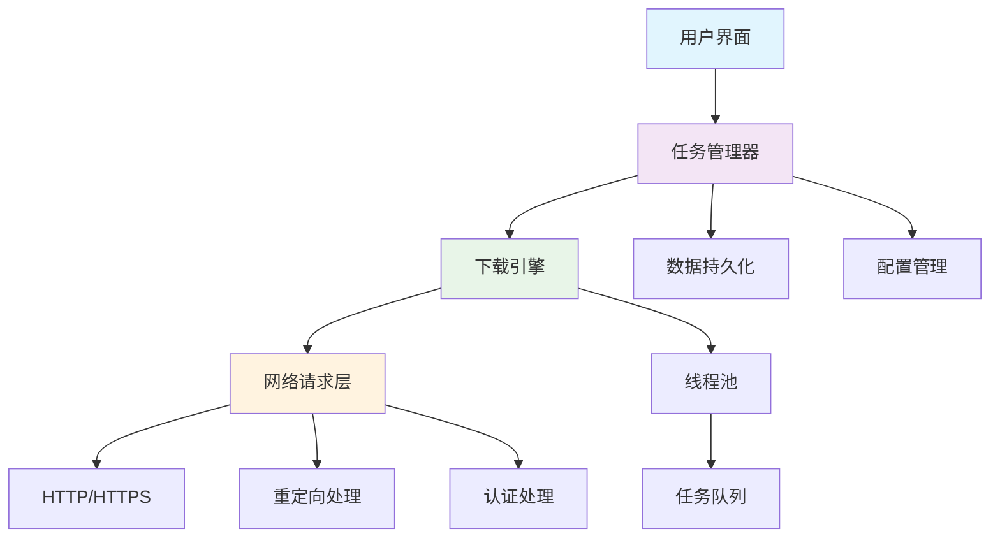
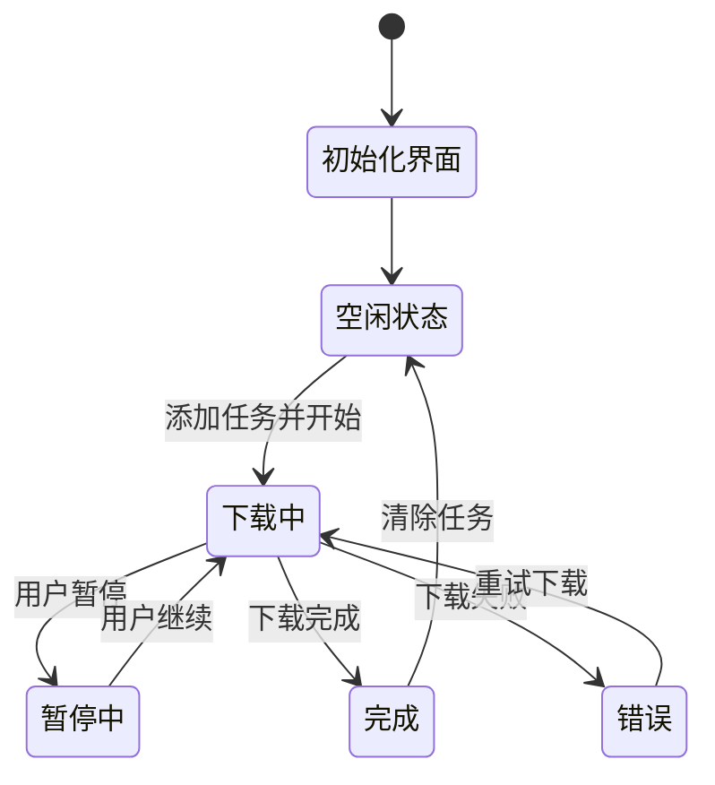

# Qt 下载器需求规范
> **文档创建时间**: 2025-11-14
> **最后更新**: 2025-11-14
> **版本**: v1.0
> **标签**: `qt`, `downloader`, `product-requirements`, `desktop-app`, `c++`

## 📑 目录

- [1. 产品概述](#1-产品概述)
- [2. 用户角色](#2-用户角色)
- [3. 功能需求](#3-功能需求)
- [4. 非功能需求](#4-非功能需求)
- [5. 界面设计](#5-界面设计)
- [6. 数据模型](#6-数据模型)
- [7. 技术规范](#7-技术规范)
- [8. 交付要求](#8-交付要求)

---

## 1. 🎯 产品概述

### 1.1 产品定位

基于 Qt 框架开发的桌面下载管理器，支持多线程并发下载，提供直观的任务管理界面和实时进度监控。

### 1.2 核心价值

- ✅ **批量下载** - 支持多任务并发下载
- ✅ **进度监控** - 实时显示下载状态和进度
- ✅ **断点续传** - 支持下载中断后继续
- ✅ **跨平台** - 支持 Windows、macOS、Linux

### 1.3 产品架构图



---

## 2. 👥 用户角色

### 2.1 目标用户

**终端用户** - 需要批量下载文件的个人用户
- 技术背景：普通计算机用户
- 使用场景：下载软件、文档、媒体文件
- 操作习惯：图形界面操作

### 2.2 用户场景


---

## 3. 📋 功能需求

### 3.1 🎛️ 任务管理

#### 3.1.1 添加任务
- **URL 输入**: 支持单个或多个 URL（每行一个）
- **URL 格式**: 支持 HTTP/HTTPS 协议
- **认证支持**: URL 中可包含用户名密码 (`user:pass@host`)
- **批量导入**: 支持从剪贴板粘贴多个 URL

#### 3.1.2 任务列表显示
**表格列必须包含**:
- **文件名**: 从 URL 提取或 Content-Disposition 解析
- **文件大小**: 字节数，获取后显示 (-1 表示未知)
- **已下载大小**: 字节数，实时刷新
- **进度百分比**: 0-100%，实时计算
- **下载速度**: B/s，实时刷新
- **状态**: 等待 / 下载中 / 已完成 / 错误

```mermaid
gantt
    title 下载任务状态流转
    dateFormat X
    axisFormat %s

    section 下载流程
    等待中     :0, 10
    下载中     :10, 100
    已完成     :100, 110
    错误处理   :a1, after a2, 20
```



#### 3.1.3 任务操作
- **开始**: 启动选中的下载任务
- **暂停**: 暂停正在下载的任务
- **取消**: 取消下载并删除未完成的文件
- **删除**: 从列表中删除已完成或失败的记录

### 3.2 ⚙️ 下载引擎

#### 3.2.1 多线程下载
```cpp
// 单任务多线程配置
const int DEFAULT_THREAD_COUNT = 4;  // 默认4线程
const int MAX_THREAD_COUNT = 16;     // 最大16线程
```

- **分段下载**: 将文件分为多个片段并发下载
- **线程管理**: 每个任务可配置独立线程数
- **负载均衡**: 动态调整各线程下载速度

#### 3.2.2 网络支持
- **协议支持**: HTTP/HTTPS
- **重定向**: 自动处理 3xx 重定向
- **认证**: 支持 Basic Authentication
- **代理支持**: 系统代理设置

#### 3.2.3 完整性校验
- **大小校验**: 下载完成后校验 Content-Length
- **MD5校验**: 服务器返回 MD5 头时进行校验
- **断点续传**: 支持从中断位置继续下载

### 3.3 💾 设置与持久化

#### 3.3.1 配置管理
- **下载目录**: 默认系统"下载"文件夹，可自定义
- **并发限制**: 全局最大同时下载数
- **线程数**: 每任务默认线程数
- **重试次数**: 失败重试次数

#### 3.3.2 任务持久化
- **自动保存**: 任务状态自动保存
- **启动恢复**: 程序启动时恢复未完成任务
- **设置保存**: 用户配置持久化存储

### 3.4 🚨 异常处理与反馈

#### 3.4.1 网络异常
- **自动重试**: 网络中断时自动重试3次
- **指数退避**: 重试间隔逐渐增加
- **错误分类**: 区分临时错误和永久错误

#### 3.4.2 用户反馈
- **状态更新**: 实时更新任务状态
- **错误提示**: 显示详细错误信息
- **完成通知**: 下载完成时系统托盘通知
- **进度提示**: 进度条和百分比显示

---

## 4. 🚀 非功能需求

### 4.1 🖥️ 平台兼容性

| 平台 | 最低版本 | 架构 | Qt 版本 |
|------|----------|------|---------|
| **Windows** | Windows 10+ | x64 | Qt 5.3-5.12 |
| **macOS** | 10.15+ | x64 | Qt 5.3-5.12 |
| **Linux** | Ubuntu 22.04+ | x64 | Qt 5.3-5.12 |

### 4.2 ⚡ 性能要求

- **内存使用**: 同时10个任务并发时，峰值内存 ≤ 200MB
- **UI响应**: 任何操作在 200ms 内给出视觉反馈
- **下载速度**: 充分利用可用带宽
- **启动时间**: 冷启动 < 3秒

### 4.3 🔒 安全性要求

- **URL验证**: 验证输入URL格式
- **文件路径**: 防止路径遍历攻击
- **下载限制**: 支持文件大小和类型限制
- **用户数据**: 本地数据加密存储

---

## 5. 🎨 界面设计

### 5.1 主界面布局

```
┌─────────────────────────────────────────────────────────┐
│ URL 输入框                                              │
│ ┌─────────────────────────────────────────────────────┐ │
│ │ https://example.com/file1.zip                       │ │
│ │ https://example.com/file2.pdf                       │ │
│ └─────────────────────────────────────────────────────┘ │
│ [添加] [开始全部] [暂停全部] [删除选中]                 │
├─────────────────────────────────────────────────────────┤
│ 任务列表 (QTableView)                                  │
│ 文件名      │ 大小     │ 已下载  │ 进度  │ 速度  │ 状态 │
│ file1.zip   │ 100MB    │ 50MB    │ 50%   │ 1MB/s │下载中│
│ file2.pdf   │ 20MB     │ 20MB    │ 100%  │ 0     │完成 │
├─────────────────────────────────────────────────────────┤
│ 全局速度: 1.5MB/s  剩余时间: 2分钟  任务数: 2/10       │
│ [设置] [关于] [退出]                                    │
└─────────────────────────────────────────────────────────┘
```

### 5.2 界面状态图



---

## 6. 📊 数据模型

### 6.1 核心数据结构

```cpp
// 下载任务数据模型
struct DownloadTask {
    QString id;                    // 唯一标识
    QUrl url;                     // 下载URL
    QString fileName;             // 本地文件名
    QString savePath;             // 保存路径
    qint64 totalBytes;           // 总大小 (-1=未知)
    qint64 downloadedBytes;      // 已下载大小
    int progress;                 // 进度百分比 (0-100)
    qint64 speed;                // 当前速度 (B/s)
    qint64 averageSpeed;         // 平均速度 (B/s)
    QDateTime startTime;         // 开始时间
    QDateTime finishTime;        // 完成时间

    enum State {
        Waiting,     // 等待开始
        Running,     // 下载中
        Paused,      // 已暂停
        Completed,   // 已完成
        Error,       // 错误
        Cancelled    // 已取消
    } state;

    enum Priority {
        Low = 1,
        Normal = 2,
        High = 3
    } priority;

    QString errorMessage;        // 错误信息
    int retryCount;             // 重试次数
    int maxRetries;             // 最大重试次数
    QStringList downloadThreads;  // 下载线程列表
};
```

### 6.2 配置数据结构

```cpp
struct DownloadSettings {
    QString defaultDownloadPath;    // 默认下载路径
    int maxConcurrentTasks;         // 最大并发任务数
    int defaultThreadCount;         // 默认线程数
    int maxRetryCount;             // 最大重试次数
    bool autoRetry;                // 自动重试
    bool startOnStartup;           // 开机启动
    bool showNotifications;        // 显示通知
    bool verifyIntegrity;          // 验证文件完整性
    qint64 maxFileSize;            // 最大文件大小限制
    QStringList blockedExtensions;  // 禁止的文件扩展名
};
```

---

## 7. 🔧 技术规范

### 7.1 技术栈

- **UI框架**: Qt Widgets (非QML)
- **网络库**: QNetworkRequest
- **并发**: QThread + QThreadPool
- **持久化**: QSettings + SQLite
- **日志**: QtMessageHandler

### 7.2 代码结构

```
FastDownloader/
├── main.cpp                 # 程序入口
├── MainWindow.h/.cpp         # 主窗口
├── MainWindow.ui             # UI文件
├── DownloadTask.h/.cpp       # 下载任务数据模型
├── DownloadManager.h/.cpp    # 下载管理器
├── Downloader.h/.cpp         # 下载引擎
├── SettingsDialog.h/.cpp     # 设置对话框
├── SettingsDialog.ui         # 设置UI
└── resources/                # 资源文件
    ├── icons/
    └── translations/
```

### 7.3 关键技术点

#### 7.3.1 多线程下载
```cpp
class DownloadThread : public QThread {
    Q_OBJECT
public:
    void run() override;
    void pause();
    void stop();

signals:
    void progressChanged(qint64 bytesReceived, qint64 bytesTotal);
    void speedChanged(qint64 speed);
    void finished(bool success, const QString& error);

private:
    QNetworkReply* m_reply;
    QUrl m_url;
    QString m_filePath;
    qint64 m_startPos;
    qint64 m_endPos;
    bool m_paused;
    bool m_stopped;
};
```

#### 7.3.2 断点续传
```cpp
// 获取文件已下载大小
qint64 getDownloadedFileSize(const QString& filePath) {
    QFile file(filePath);
    if (file.exists()) {
        return file.size();
    }
    return 0;
}

// 设置Range请求头
QNetworkRequest createRangeRequest(const QUrl& url, qint64 startPos) {
    QNetworkRequest request(url);
    QString range = QString("bytes=%1-").arg(startPos);
    request.setRawHeader("Range", range.toLatin1());
    return request;
}
```

### 7.4 性能优化

- **内存管理**: 及时释放下载完成的数据
- **网络优化**: 连接池和Keep-Alive
- **UI更新**: 使用定时器减少UI刷新频率
- **磁盘IO**: 缓冲写入，减少磁盘IO次数

---

## 8. 📦 交付要求

### 8.1 交付物清单

- [x] **源代码**: 完整的C++源码实现
- [x] **资源文件**: 图标、UI文件等
- [x] **构建脚本**: CMakeLists.txt或.pro文件
- [ ] **测试用例**: 单元测试和集成测试
- [ ] **部署文档**: 编译和部署说明

### 8.2 代码规范

```cpp
// 命名规范
class DownloadManager : public QObject {  // 类名：PascalCase
    Q_OBJECT
public:
    explicit DownloadManager(QObject *parent = nullptr);  // 函数名：camelCase

private slots:
    void onDownloadProgress(qint64 bytesReceived, qint64 bytesTotal);  // 槽函数命名

private:
    int m_maxConcurrentTasks;  // 成员变量：m_前缀，camelCase
    QString m_defaultPath;
};
```

### 8.3 质量要求

- **代码覆盖率**: ≥80%
- **内存泄漏**: 无内存泄漏
- **文档完整**: 关键函数有注释
- **异常处理**: 完善的错误处理机制

---

## 📊 项目里程碑

### Phase 1: 基础框架 (2周)
- [x] 主界面设计
- [x] 数据模型定义
- [x] 基础下载功能

### Phase 2: 核心功能 (3周)
- [ ] 多线程下载实现
- [ ] 断点续传功能
- [ ] 任务管理界面

### Phase 3: 高级功能 (2周)
- [ ] 配置管理
- [ ] 异常处理
- [ ] 性能优化

### Phase 4: 测试发布 (1周)
- [ ] 功能测试
- [ ] 性能测试
- [ ] 代码审查

---

## 📈 成功指标

### 8.1 功能指标
- ✅ 支持同时下载10个文件
- ✅ 下载速度达到带宽的90%以上
- ✅ 程序启动时间<3秒
- ✅ 内存使用<200MB（10个并发任务）

### 8.2 用户体验指标
- ✅ 界面响应时间<200ms
- ✅ 支持断点续传
- ✅ 错误恢复成功率>95%
- ✅ 用户操作流程简化

---

## 📚 参考资料

- [Qt 官方文档](https://doc.qt.io/)
- [QNetworkRequest 类文档](https://doc.qt.io/qt-5/qnetworkrequest.html)
- [Qt 多线程编程指南](https://doc.qt.io/qt-5/thread-support.html)
- [HTTP 协议规范](https://tools.ietf.org/html/rfc7231)

---

> **💡 开发建议**:
> - 采用模块化设计，便于功能扩展
> - 重视用户体验，界面简洁直观
> - 完善错误处理，提高程序稳定性
> - 充分测试各种网络环境和异常情况